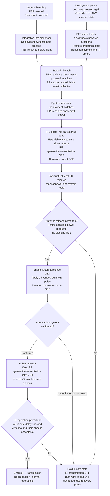

# Spacecraft Startup and Antenna Deployment

Status: proposed flight sequence for team review, 2026-09-23. This describes intended behavior, not verified hardware or firmware implementation.

EMBER has one deployable UHF antenna restrained by a burn wire. Solar panels are fixed. The EPS may power the spacecraft immediately after ejection, but antenna release must wait at least 30 minutes and RF generation/transmission at least 45 minutes. Both delays use the same ejection reference; they are not consecutive delays.

## Startup sequence

The Mermaid source below can be copied into other Markdown documents or a Mermaid editor. GitHub renders it directly.

The reset branch applies throughout the powered sequence, including normal operations. With multiple deployment switches, the hardware must enforce the selected safe logic; release of only one switch must not bypass another switch that remains pressed.

## Board responsibilities (proposed)

| Board | Responsibility |
|---|---|
| EPS | RBF and deployment-switch connections; hardware isolation of battery and solar power from powered functions; switched supplies to radio and antenna release circuitry. |
| IHU | Startup state, elapsed-time tracking, health checks, antenna release request, and permission to begin transmitting. Timer ownership across EPS/IHU remains a team decision; this diagram proposes IHU sequencing. |
| Transceiver | RF hardware inhibits. Suggested location for the burn-wire driver and its local hardware inhibits if the antenna harness terminates here; final allocation remains open. |
| Payload | Boot and operate under the selected power policy; no antenna deployment responsibility. |

## Requirements versus proposed operating policy

CDS Rev. 14.1 requirements used here:

- Sections 2.3.1 and 2.3.2: powered functions off while stowed; deployment switches electrically disconnect the power system while actuated.
- Section 2.3.2.4: switch release followed by re-actuation restores prelaunch state, including transmission and deployment timer resets.
- Sections 2.3.4 and 2.3.5: RBF access and power cutoff requirements. Some dispensers require RBF removal before insertion.
- Sections 2.3.7 and 2.3.8: at least three independent RF inhibits and three independent inhibits against unintended deployable release. An inhibit is a physical device between source and hazard; a timer is not an independent inhibit. The removed RBF pin is not a remaining launch inhibit.
- Sections 2.4.4 and 2.4.5: minimum 30-minute deployment delay and 45-minute RF delay.
- Section 1.4: assigned launch-provider requirements supersede the CDS.

The health checks, bounded burn pulse, antenna confirmation gate, and safe hold are proposed operating policy. This diagram does not establish hardware-inhibit independence or flight compliance.

## Implementation decisions still needed

- Define pulse duration, current limits, cooldown, and maximum retry count from antenna/burn-wire testing. Do not leave the burn output energized indefinitely.
- Decide whether to add an antenna-open sensor. Burn current alone does not prove deployment. Without a sensor, explicitly approve an unconfirmed-deployment policy before permitting transmission; the diagram currently holds safe.
- Define recovery after an ordinary processor reset or brownout. Never shorten the required delays or repeat a burn blindly. A stored uptime timestamp alone cannot measure time across a reset. Starting a full delay again is conservative for timing, but deployment-attempt state also needs handling.
- Define ground handling and test procedures: RBF removal with unpressed deployment switches is not proof of orbital ejection. Prevent unintended burn or RF operation during the interval before dispenser insertion.
- Verify independent hardware barriers for RF and burn-wire energy paths, including alternate power paths through signal connections. Neither the timer nor a software command alone counts as an independent inhibit.

## References and relationship to existing notes

- [Cal Poly CubeSat information and specification downloads](https://www.cubesat.org/cubesatinfo): CubeSat Design Specification Rev. 14.1, dated 2022-02-09, especially pages 14-15. Source reviewed for this sequence: `CDS+REV14_1+2022-02-09.pdf` supplied during the design discussion.
- [Inhibit and deployment architecture](inhibit_and_deployment.md): requirements baseline, proposed board allocation, documented prototype limitations, and remaining flight decisions. Neither document verifies hardware implementation.
