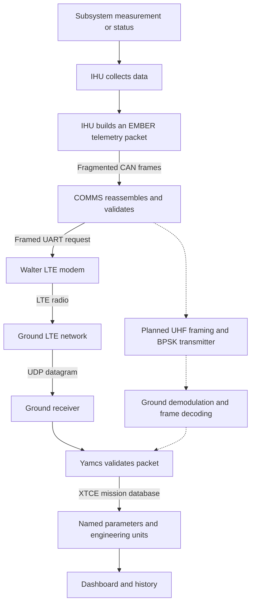

# Telemetry: from a subsystem to the ground

**Read this before implementing subsystem telemetry.** A telemetry packet carries
numbers in agreed positions. The ground definitions tell Yamcs what those numbers
mean, how to convert them, and which named parameters to publish for displays and
history. Every subsystem developer needs to understand both halves of that contract.

**Status:** Implementation walkthrough and team development reference, checked
against the repository and saved bench evidence on October 3, 2026. The native
EPS → IHU → CAN → COMMS → Walter LTE → Yamcs bench path has demonstrated real
hardware delivery. Flight IDs, production scheduling/queues, and the UHF BPSK
packet path are not finalized. This guide explains the implementation; it does
not allocate new IDs or replace the authoritative contracts linked below.

[Architecture index](README.md) · [Documentation home](../README.md) ·
[Shared interfaces](../../system/README.md) · [Ground software](../../ground/README.md)

## 1. The complete path



The diagram's solid path is the demonstrated native EPS bench path. Dashed steps
show the intended UHF alternative. Payload and other subsystem integration must
still follow their own agreed interfaces; their inclusion in the architecture does
not imply they already generate native packets.

Separate these three jobs:

| Layer | Job | Example |
|---|---|---|
| Measurement | Obtain and interpret a physical reading or software state | Read LTC4162 `vbat` and convert it to millivolts |
| Application packet | Define the meaning, order, size, and representation of fields | `POWER_STATUS`, containing `battery_mv` |
| Transport | Carry the packet and recover its bytes at the other end | CAN fragments, UART envelope, LTE UDP, future UHF frames |

Changing transport need not change what battery voltage means. The demonstrated
LTE path preserves the original application packet bytes from IHU to Yamcs.
The future UHF path must establish its own framing, coding, size limits, and
receiver integration before the same claim can be made there.

## 2. Who owns what?

The [data-interface baseline](../../system/interfaces/data_interfaces.md) defines
system ownership. For development, use this division of responsibilities:

| Owner | Responsibility |
|---|---|
| Subsystem developer | Define each observation's meaning, source, units, conversion, validity, and update behavior |
| IHU | Collect/aggregate subsystem observations and generate system telemetry; retain source identity and measurement timing |
| COMMS | Carry packets, manage transport, and implement the agreed operational queue policy |
| Ground receiver | Recover and validate packets from the external transport and deliver them to Yamcs |
| Ground/Yamcs developer | Maintain matching decode definitions, parameter validity, displays, and archive access |

EPS currently exposes registers; it is not the CAN packet producer. The IHU reads
the charger over I2C and produces EPS telemetry. Other subsystems may have their
own processors, but packet production and routing must be explicitly agreed.

Operational queue ownership remains COMMS. The recent LTE tests use a temporary,
volatile FIFO in the IHU bench harness. Do not treat that placement as a flight
architecture decision.

## 3. Where the definitions and code live

Paths below are relative to the repository root. The reviewed laptop checkout is
`/Users/nick/Desktop/ember`; the documented Pi checkout is
`/home/ngrabbs/work/MSU_Cubesat/ember`.

| File | Purpose |
|---|---|
| [Operations telemetry dictionary](operations/Ground_Operations_Command_Telemetry/04-telemetry-dictionary.md) | Application meanings and proposed telemetry groups; operations material remains draft |
| [ground/ember/ltc4162.json](../../ground/ember/ltc4162.json) | Charger register addresses, signed interpretation, and physical conversion factors |
| [ground/ember/dictionary.json](../../ground/ember/dictionary.json) | Implemented bench wire contract: schema, packet IDs, field order/types, enums, units, scales, and unavailable values |
| [firmware/can_feather_bench/eps_readout.h](../../firmware/can_feather_bench/eps_readout.h) | Actual Feather IHU register reader with SMBus PEC checks |
| [firmware/can_feather_bench/power_packet.h](../../firmware/can_feather_bench/power_packet.h) | Native IHU EPS conversion and packet construction |
| [firmware/can_feather_bench/main.c](../../firmware/can_feather_bench/main.c) | Both IHU and COMMS CAN bench roles, selected at build time; packet submission and relay |
| [firmware/comms_transport/can_fragment.h](../../firmware/comms_transport/can_fragment.h) | CAN fragmentation and reassembly rules |
| [firmware/comms_transport/uart_link.h](../../firmware/comms_transport/uart_link.h) | Framed request envelope used across the bench links |
| [firmware/walter_lte_bench/src/main.cpp](../../firmware/walter_lte_bench/src/main.cpp) | Walter request handling and modem UDP submission |
| [ground/ember/lte_receiver.py](../../ground/ember/lte_receiver.py) | Native LTE packet validation and unchanged forwarding to Yamcs |
| [ground/ember/codec.py](../../ground/ember/codec.py) | Python encoder/decoder using the packet dictionary |
| [ground/ember/generate_c.py](../../ground/ember/generate_c.py) | Generates firmware IDs, field offsets, and sizes from the packet dictionary |
| [ground/ember/generate_ltc4162.py](../../ground/ember/generate_ltc4162.py) | Generates the shared charger-register header from the register dictionary |
| [ground/ember/generate_mdb.py](../../ground/ember/generate_mdb.py) | Generates Yamcs XTCE definitions and Java wire offsets |
| [ground/yamcs/prepare.py](../../ground/yamcs/prepare.py) | Prepares Yamcs runtime files, instances, and input links |
| [EmberPacketPreprocessor.java](../../ground/yamcs/ember-java/EmberPacketPreprocessor.java) | Rejects malformed packets before archive/XTCE processing and tracks sequence gaps |
| [ground/yamcs/generate_displays.py](../../ground/yamcs/generate_displays.py) | Generates dashboard widgets and parameter-table bindings |

The packet dictionary generates layout constants; it does not automatically
implement sensor acquisition or every firmware conversion. The native EPS
conversion expressions are implemented in `power_packet.h` and must remain
consistent with the chip specification and the wire contract.

Yamcs calls its telemetry/command definitions the **Mission Database (MDB)**.
Here, that database is loaded from **XTCE XML**, which describes containers
(packet layouts), parameters, types, units, and calibrators.
See the [Yamcs MDB documentation](https://docs.yamcs.org/yamcs-server-manual/mdb/).

### Generated Yamcs files

`prepare.py` generates these files rather than requiring hand-maintained XML:

```text
ground/yamcs/.runtime/ember-generated/ember.xml
ground/yamcs/.runtime/ember-generated/WireProfile.java
```

It copies them into the prepared quickstart source tree:

```text
ground/yamcs/.runtime/quickstart/src/main/yamcs/mdb/ember.xml
ground/yamcs/.runtime/quickstart/src/main/java/com/example/ember/WireProfile.java
```

It also writes instance configuration under:

```text
ground/yamcs/.runtime/quickstart/src/main/yamcs/etc/
    yamcs.ember.yaml
    yamcs.ember-lte.yaml
```

These are ignored runtime outputs and may be absent in a source-only checkout.
Edit tracked definitions/generators, then regenerate. Follow the
[Yamcs setup procedure](../../ground/yamcs/README.md) for rebuilding/restarting the
running installation and installing displays while preserving the archive.

## 4. Worked example: battery voltage

This example uses the first real packet from the
[queued EPS delivery evidence](../../system/ground_station/evidence/queued-eps-20261003-01/report.json).
The run occurred October 2, 2026 in America/Chicago; its UTC label is October 3.
All three queued packets were received in order and matched the Yamcs archive
byte for byte. This is recorded evidence, not a claim about a current live reading.

### Step A: the charger measures voltage

The LTC4162-L has an ADC and exposes battery voltage through its `vbat` register:

```text
I2C device address: 0x68
vbat register:      0x3A
Interpretation:    signed 16-bit number
Conversion:        raw × 0.0001924 × cell_count volts
Captured raw word: 20777 decimal = 0x5129
```

The conversion factor comes from the
[Analog Devices LTC4162-L datasheet](https://www.analog.com/media/en/technical-documentation/data-sheets/LTC4162-L.pdf)
and is recorded in the register dictionary. The raw number is not yet volts.

### Step B: the IHU reads and validates the word

`eps_word()` sends the register address, performs a repeated-start read, and
receives two data bytes plus a PEC checksum. It checks PEC before accepting the
word. The chip's register words are little endian:

```text
29 51 [PEC] → 0x5129 → 20777
```

The Feather bench reader uses I2C1 at 100 kHz, SDA GPIO2 and SCL GPIO3. It reads
all 19 registers in the profile. Any failed I2C/PEC read prevents a partial native
packet from being emitted.

The observations are sequential, not an atomic chip snapshot. A successful poll
does not prove that the ADC performed a new conversion since the preceding poll.

### Step C: the IHU converts to integer millivolts

For the confirmed two-cell board configuration:

```text
20777 × 0.0001924 × 2 = 7.9949896 V
Rounded to millivolts: 7995 mV
```

The native firmware implements this as integer arithmetic:

```c
VALUE(BATTERY_MV, power_round((int16_t)raw->vbat * 3848, 10000));
```

It retains both representations in the payload:

```text
raw_vbat   = 20777    original chip word
battery_mv = 7995     converted pack voltage in millivolts
```

This permits later conversion audits. The producer checks ADC validity and
compatible chemistry/cell configuration before publishing engineering values.
In this capture, the detected cell field was zero; the confirmed two-cell board
configuration supplied the conversion assumption.

### Step D: the IHU constructs POWER_STATUS

The application header identifies the packet:

```text
schema_version = 1
kind           = 1       telemetry
message_id     = 16      0x10, POWER_STATUS
source         = 2       IHU
target         = 1       ground
```

The packet is 128 bytes:

```text
6-byte CCSDS primary header
24-byte EMBER secondary header
96-byte POWER_STATUS payload
2-byte CRC-16/CCITT-FALSE
─────────────────────────────
128 bytes total
```

The primary header contains the downlink APID, sequence flags/count, and packet
length. The secondary header includes schema, kind, message ID, source/target,
transaction identity, source boot ID, uptime, and payload length. See the
[bench packet contract](../../system/protocols/ember_bench_v1.md) for complete
field offsets and CRC parameters.

Selected bytes from the captured sequence-zero packet follow. Offsets are
zero-based from the beginning of the complete packet:

| Byte offset | Meaning | Captured bytes | Decoded value |
|---|---|---|---|
| 7 | Kind | `01` | Telemetry |
| 8–9 | Message ID | `00 10` | POWER_STATUS |
| 10 | Source | `02` | IHU |
| 11 | Target | `01` | Ground |
| 28–29 | Payload length | `00 60` | 96 bytes |
| 56–59 | Battery millivolts | `00 00 1F 3B` | 7995 |
| 104–105 | Raw battery word | `51 29` | 20777 |
| 126–127 | Packet CRC | `23 DD` | Integrity check |

**Byte order changes at the boundary:** LTC4162 register words are little endian;
EMBER packet fields are big endian. Serialize explicitly. Do not transmit the
in-memory bytes of a C structure and assume they match the wire layout.

### Step E: CAN transports the packet to COMMS

A 128-byte application packet does not fit in one classic CAN frame. The bench
wraps it in a COBS/CRC request envelope containing boot/request identities, then
fragments the envelope across frames. Each frame carries:

| Frame byte | Meaning |
|---|---|
| 0 | Version marker and START/END flags |
| 1–2 | Transfer token |
| 3 | Fragment index |
| 4–7 | Up to four envelope bytes |

Development CAN IDs are `0x710` for IHU → COMMS and `0x711` for the return path.
COMMS checks ordering, token, size, timeout, envelope integrity, and telemetry
structure before forwarding. Detailed rules are in the
[CAN bench reference](../../firmware/can_feather_bench/README.md).

**CAN ID `0x710` is not telemetry message ID `0x10`.** The former identifies
internal bus traffic; the latter identifies the application packet's meaning.
Likewise, the downlink APID `0x101` is a separate packet-header identifier.
These are local bench assignments, not final flight allocations.

### Step F: COMMS relays to Walter, then LTE carries the bytes

COMMS sends a framed UART `SEND_PACKET` request containing the original packet.
Walter submits its bytes as a UDP payload using the LTE modem. The modem and
ground LTE network handle radio modulation, coding, reception, and network
protocols; Yamcs is downstream of that radio processing.

The current ground receiver accepts Walter traffic at UDP port `51000`, checks
the configured peer (`172.16.0.2:51001`) and native packet contract, then forwards
the original bytes to local UDP `10018`.

The isolated Yamcs instance is **`ember-lte`**, with input link **`eps-lte-in`**.
The `MODEM_ACCEPTED` response means modem submission was accepted. Ground receipt
and Yamcs archive presence must be checked separately; they are demonstrated by
this example's matching capture and archive evidence.

### Step G: Yamcs selects the definition and publishes a parameter

The Java preprocessor checks header identity, length, schema, and CRC before
XTCE extraction. The generated `POWER_STATUS` container matches:

```text
kind = 1 AND message_id = 16
```

The ordered fields tell Yamcs where each value is located. The packet does not
carry the field name or a JSON object. The battery definition in the source
packet dictionary is:

```json
{
  "name": "battery_mv",
  "type": "i32",
  "unit": "V",
  "unavailable": -2147483648,
  "scale": 0.001
}
```

That produces a signed 32-bit wire encoding and a Yamcs calibrator:

```text
Bytes 00 00 1F 3B → raw packet value 7995
Calibrator:       7995 × 0.001 → 7.995 V
Parameter:        /ember/POWER_STATUS_battery_mv
```

The name ends in `_mv` because its wire value is millivolts. Its calibrated Yamcs
value is in volts. Distinguish three representations:

| Representation | Value | Meaning |
|---|---|---|
| Chip register word | 20777 | Original ADC result |
| Yamcs raw value for `battery_mv` | 7995 | Packet's converted integer millivolts |
| Yamcs engineering value for `battery_mv` | 7.995 V | Calibrated display value |

The original chip word is independently exposed as
`/ember/POWER_STATUS_raw_vbat`.

### Step H: the dashboard subscribes to the parameter

`generate_displays.py` binds the “Battery pack” widget to
`/ember/POWER_STATUS_battery_mv` and the conversion-valid parameter.
The [value script](../../ground/yamcs/display-scripts/eps-value.js) checks validity
and formats the calibrated value with its units. `EPS.par` provides the raw and
quality parameters; `EPS.opi` provides the dashboard.

The same `/ember/...` parameter names are used within both Yamcs instances.
Selecting `ember-lte` versus `ember` selects the data source/processor/archive;
it does not rename the mission database root to `/ember-lte`.

## 5. Worked example: negative battery current

The same packet contains this raw battery-current word:

```text
raw_ibat = 64929 = 0xFDA1
```

Raw words are retained as unsigned 16-bit values. For conversion, `ibat` is a
signed ADC measurement, so its two's-complement interpretation is:

```text
64929 − 65536 = −607
```

Using the current assumed 10 mΩ sense resistor:

```text
−607 × 1.466 µV ÷ 0.01 Ω = −88986.2 µA
Rounded packet field: battery_ua = −88986
Packet bytes 68–71:   FF FE A4 66
```

The dictionary defines `battery_ua` as signed `i32`, with scale `0.001` and
engineering units `mA`. Yamcs therefore publishes:

```text
/ember/POWER_STATUS_battery_ua = −88.986 mA
```

Signedness matters: interpreting those bytes as unsigned would produce a very
large positive value. Units matter too: this scale converts microamps to
milliamps, not amps.

The fitted sense resistors remain unverified. The packet includes
`sense_values_verified=0` and the assumed resistance values. Treat the current
magnitude as provisional until the fitted parts are confirmed.

## 6. Validity, freshness, and time are part of telemetry

A number alone is insufficient. The receiving team needs to know whether it is
available, valid, recent, and correctly interpreted.

The [POWER_STATUS contract](../../system/protocols/eps_power_status_v1.md) defines
these fields and behaviors:

- `adc_valid`: chip telemetry-status bit; it is not a new-sample counter.
- `readout_present` / `readout_valid`: readout existence and producer-defined validity.
- `conversion_valid`: whether an engineering conversion is usable.
- `readout_count`: complete observations packaged by the producer.
- `ihu_readout_uptime_ms`: IHU uptime after the register reads.
- `readout_age_ms`: producer-specific age at packet construction; not ADC age.
- `configured_cells`, `detected_cells`, and sense-resistor fields: conversion assumptions.
- `provenance`: identifies who produced the application packet.

Unavailable engineering conversions use signed `INT32_MIN` (`−2147483648`).
The generated XTCE definition excludes that sentinel from the valid raw range.
A conversion-invalid context calibrator yields engineering NaN so charts show
gaps. The dashboard suppresses unavailable/expired values.

The dictionary declares a one-second expected POWER_STATUS interval; the
current Yamcs configuration expires its parameters after about 1.9 seconds
without a new packet. That expectation does not create a periodic firmware
scheduler. Manual/queued native tests can produce short bursts and then expire.

**Packet arrival time is not measurement time.** Current Yamcs generation time
is assigned from ground reception time. IHU uptime is decoded separately and is
not UTC. Queued native packets preserve original readings and capture uptime.
Their `readout_age_ms=0` was set at construction and does not include later queue
or radio delay. A newly arrived queued packet is not automatically a current
physical measurement.

Sequential reads are not simultaneous measurements. Charger die temperature
is not battery temperature. This path does not infer state of charge or battery
thermistor temperature.

## 7. Distinguish native LTE from the older Pi wrapper

Both paths use POWER_STATUS and the same display definitions, but their
provenance and source timing differ:

| Property | Older UART/Pi wrapper | Native IHU/LTE bench |
|---|---|---|
| Chip readings originate on | IHU | IHU |
| Complete telemetry packet constructed on | Pi, from IHU UART JSON | IHU |
| Provenance | `IHU_UART_PI_WRAPPER` (1) | `IHU_NATIVE` (2) |
| Common boot/uptime fields describe | Pi bridge session/process | Actual IHU producer |
| `bridge_session_id` | Pi session ID | Zero |
| Yamcs instance | `ember` | `ember-lte` |
| Input link / UDP port | `eps-uart-in` / 10017 | `eps-lte-in` / 10018 |

The wrapper implementation is [eps_bridge.py](../../ground/ember/eps_bridge.py).
The [wrapper setup guide](../../system/ground_station/eps_yamcs_setup.md) explains
its polling, failure handling, and conversion assumptions. A wrapper dashboard
update is not evidence of CAN or radio delivery.

The upstream `myproject` Yamcs instance is demonstration data and is separate
from these EMBER paths.

## 8. What changes for UHF BPSK?

The intended UHF path is:

```text
EMBER packet → agreed UHF framing/coding → BPSK transmit bits → RF
RF → ground demodulation → frame/coding recovery → original EMBER packet → Yamcs
```

BPSK is the waveform layer. XTCE describes the recovered application packet;
it does not demodulate the RF signal. Ground software must recover packet
boundaries, remove any external framing, perform the agreed link checks, and
feed application packets to a configured Yamcs link.

The [UHF firmware checklist](../../firmware/comms/README.md) still lists the TX
state machine, framing/bitstream path for BPSK/DBPSK, and RX packet decoding as
unfinished. RF framing, coding/FEC, buffer limits, and ground receiver integration
need agreement and validation. Do not treat the LTE test as proof of UHF delivery.

## 9. Adding telemetry for your subsystem

Use this workflow when implementing a new measurement or status report.

1. **Agree on its meaning and ownership.** Consult the operations dictionary and
   data-interface baseline. Specify what is measured, who produces it, and whether
   it is periodic, requested, or event-driven. New message IDs require coordination;
   this guide does not allocate them.
2. **Define acquisition and conversion.** Record register/API source, signedness,
   conversion formula, hardware assumptions, sample timing, and failure behavior.
   For a temperature, specify which component or physical location it represents.
3. **Define the wire contract.** Specify field order, width, byte order, fixed-point
   units, enum meanings, unavailable encoding, quality fields, and timestamp meaning.
   Add the agreed bench implementation to `ground/ember/dictionary.json` and reconcile
   the application meaning with operations documentation.
4. **Implement the producer.** Read the real source, check failures, convert explicitly,
   serialize with generated offsets, and include identity/sequence/integrity fields.
   Adding a dictionary field does not implement the firmware read or populate it.
5. **Integrate the route.** Confirm the internal transport, COMMS/Walter or UHF
   admission and validation rules, size bounds, and queues support the packet. Current
   COMMS and Walter validators explicitly allow selected message IDs; a new dictionary
   entry alone does not make a new packet routable. The LTE receiver currently accepts
   native POWER_STATUS only and will also need an intentional update for another type.
6. **Regenerate ground definitions and displays.** Build matching firmware constants,
   XTCE/Java offsets, and instance runtime files. Bind the dashboard to the generated
   parameter name. Implement validity and freshness behavior alongside the numeric display.
7. **Verify each boundary.** Use independently calculated expected values and wire
   vectors. Decode producer bytes with the ground codec, compare bytes across transports,
   and check Yamcs raw/engineering values and archive contents. Include negative values,
   unavailable values, sensor failure, and reset/delay behavior relevant to the field.
8. **Record evidence and update the owning checklist.** Identify producer image, schema,
   hardware assumptions, route, and observed result. Distinguish local CAN success,
   modem acceptance, ground receipt, and archive match.

Changing field order, widths, scaling, or interpretation can break existing
producers and archived-packet decoding. Coordinate schema evolution rather than
silently rewriting an existing contract. Flight versioning remains open.

### Review questions before calling a field complete

- Can another developer calculate the value from the source observation?
- Do producer and ground agree on every byte and unit?
- Does the display show the intended physical quantity, with unusable values hidden?
- Can ground distinguish a failed read, a stopped stream, and a delayed packet?
- Have actual subsystem bytes reached the ground archive through the claimed route?

## 10. Read and reproduce the example

Start with these files side by side:

1. [Packet dictionary](../../ground/ember/dictionary.json): find `POWER_STATUS`,
   `battery_mv`, and `battery_ua`.
2. [Native producer](../../firmware/can_feather_bench/power_packet.h): follow the
   conversion expressions and serialization.
3. [MDB generator](../../ground/ember/generate_mdb.py): follow parameter names,
   container matching, scales, and validity rules.
4. [Display generator](../../ground/yamcs/generate_displays.py): find the
   “Battery pack” binding.

To inspect the saved hardware packet without connecting hardware, starting RF,
or modifying Yamcs, run this from the repository root:

```sh
python3 - <<'PY'
import json
import sys
from pathlib import Path

sys.path.insert(0, str(Path('ground/ember').resolve()))
from codec import decode

path = Path('system/ground_station/evidence/queued-eps-20261003-01/report.json')
report = json.loads(path.read_text())
packet = bytes.fromhex(report['host']['queued'][0]['hex'])
decoded = decode(packet)
print(json.dumps(decoded, indent=2))
print('battery bytes:', packet[56:60].hex(' '))
print('current bytes:', packet[68:72].hex(' '))
PY
```

Expected values include `raw_vbat=20777`, `battery_mv=7995`,
`raw_ibat=64929`, and `battery_ua=-88986`. The engineering conversions are
7.995 V and −88.986 mA.

For transport reproduction and current qualification limits, use the
[queued hardware delivery record](../../ground/lte/results/2026-10-02-queued-eps.md),
[CAN bench reference](../../firmware/can_feather_bench/README.md), and
[Yamcs runbook](../../ground/yamcs/README.md). Some earlier overview/status prose
predates these tests; use dated implementation evidence for bench capability
and the owning interface/operations documents for architectural decisions.
