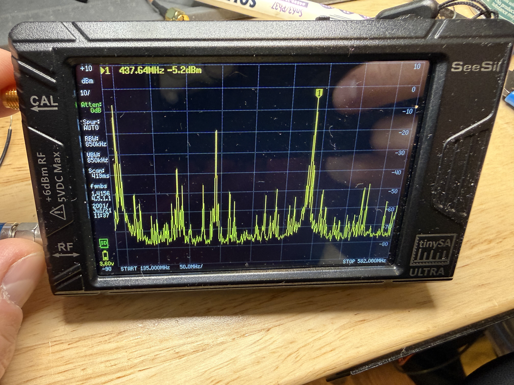

# Si5351A Bring-Up Log

## Date: 2026-04-03

## Summary
Si5351A clock generator successfully brought up on Adafruit STEMMA QT breakout
board with Raspberry Pi Pico 2. Both clock outputs verified at correct
frequencies. One register configuration bug found and fixed during bring-up.

## Hardware
- **Board:** Adafruit Si5351A Clock Generator STEMMA QT breakout
- **Controller:** Raspberry Pi Pico 2 (RP2350)
- **Test instruments:** TinySA (spectrum analyzer), oscilloscope
- **Connections:** I2C on GP4/GP5, powered from Pico 3V3

## Results

### CLK1 (RX LO — SMA output)
- **Frequency:** 145.913 MHz (within expected tolerance of 145.900 MHz)
- **Power:** -6.1 dBm at TinySA input (through SMA cable)
- **Enable/disable:** Working, peak appears and disappears on command

### CLK0 (TX carrier — header pin)
- **Frequency:** 145.667 MHz (confirmed via frequency stepping)
- **Radiated level:** -30.6 dBm on TinySA (coupling through board, not conducted)
- **Frequency stepping:** +/- 100 kHz steps track correctly
- Scope verification of CLK0 header pin: not yet tested with corrected firmware

## Bug Found and Fixed

### Symptom
Si5351A initialized without I2C errors. PLLs were running (weak radiated
energy visible on TinySA that tracked frequency changes). But no signal on
CLK0 or CLK1 output pins — oscilloscope showed flat line, TinySA showed only
very weak radiated emissions (-71 to -94 dBm).

### Root Cause
Clock control registers (reg 16, 17) bits 3:2 select the clock source for
the output pin:
- `00` = XTAL passthrough (25 MHz crystal)
- `01` = CLKIN
- `11` = Multisynth divider output

The driver was not setting bits 3:2, leaving them at the default `00` (XTAL).
The PLLs and multisynth dividers were configured and running correctly, but
their outputs were never routed to the output pins.

### Fix
Added `SI5351_CLK_SRC_MS` (0x0C, bits 3:2 = 11) to the clock control register
writes in `si5351a.c`. This routes the multisynth divider output to the pins.

```c
// Before (broken): reg value = 0x43 / 0x63
SI5351_CLK_SRC_PLLA | SI5351_CLK_INT_MODE | SI5351_CLK_DRV_8MA

// After (working): reg value = 0x4F / 0x6F
SI5351_CLK_SRC_PLLA | SI5351_CLK_INT_MODE | SI5351_CLK_SRC_MS | SI5351_CLK_DRV_8MA
```

### Lesson
Always check the output source mux bits when writing Si5351 clock control
registers. AN619 documents these as CLK_SRC[1:0] in the register description.
Many example drivers online include this implicitly but don't call it out.

## Spectrum — Si5351A Direct (No Tripler)

Span 125–502 MHz, Si5351A CLK0 output straight into TinySA. The 3rd harmonic
of the square wave is visible at 437.64 MHz / -5.2 dBm, but the noise floor
is high with energy spread across many harmonics and spurs.



## Files
- Driver: `firmware/comms/drivers/si5351a.c`, `si5351a.h`
- Test app: `firmware/comms/drivers/si5351a_bringup.c`
- Build: `firmware/comms/drivers/CMakeLists.txt`

---

## Date: 2026-05-31 — LO Drive Verification for ADE-1+ Mixer

### Summary

Quantitative measurement of Si5351A CLK1 output power and harmonic content
at 145.9 MHz, in support of the SA612 → ADE-1+ mixer swap (see
`design/rx_mixer_trade_study.md`). Confirms LO drive level exceeds the
+7 dBm target for the passive mixer and validates the 5-pole LO LPF
design margin against the 3rd harmonic.

**Result: PCB design VALIDATED for fab — no LO chain changes required.**

### Hardware

- **DUT:** Adafruit 5640 Si5351A breakout (CLK1 SMA pigtail)
- **Controller:** Pico 2 (RP2350), CircuitPython, code at
  `bringup/si5351_test_code.py`
  - CLK1 = 145.900 MHz, integer multisynth (PLL_A = 875.4 MHz / 6), drive = 8 mA
- **Test chain:** CLK1 SMA → BECEN DC block → Nooelec 20 dB pad → TinySA Ultra
  - Pad loss characterized at -19.53 dB @ 144 MHz, -19.53 dB @ 434 MHz
    (from tool inventory pad characterization log)
- **Procedure:** per `bringup/lo_drive_verification.md`

### Results — measured

| Marker | Frequency | TinySA reading | Source power (+ 19.6 dB pad/cable) | Relative to fundamental |
|---|---|---|---|---|
| Fundamental | 145.8953 MHz | -10.2 dBm | **+9.4 dBm** | 0 dB (ref) |
| 2nd harmonic | 291.7 MHz | -27.4 dBm | -7.8 dBm | -17.2 dB |
| **3rd harmonic** | **437.683 MHz** | **-22.4 dBm** | **-2.77 dBm** | **-12.2 dB** |

Frequency accuracy: 145.8953 vs target 145.9000 = 4.7 kHz error
(~32 ppm — within typical 25 MHz crystal tolerance, easily corrected in
firmware if needed via Si5351 correction register).

### Analysis

**Fundamental power +9.4 dBm into 50 Ω:**
- ADE-1+ target LO drive: +7 dBm (Level-7 mixer)
- Acceptable range: +4 to +10 dBm with conversion-loss penalty outside +7
- Margin to spec: +2.4 dB above target — squarely in the sweet spot
- **PCB decision validated: populate R4 as 0 Ω** (breakout has no series R,
  equivalent to R4 = 0 Ω on PCB). 33 Ω would drop to ~+6 dBm, also acceptable.

**2nd harmonic at -17 dB rel:**
- Expected for Si5351A — duty-cycle imbalance produces some even-harmonic
  content despite the ideal square wave being odd-harmonic-only
- Typical range -15 to -25 dB rel; we're at the strong end but within spec
- Frequency (291.8 MHz) doesn't land in any sensitive band — non-issue

**3rd harmonic at -12.2 dB rel (-2.77 dBm source):**
- Ideal square-wave theory: -9.5 dB; real Si5351: -10 to -15 dB typ
- We're squarely in the expected range
- This is the harmonic that matters because it lands at 437.7 MHz, on top
  of our own TX band

### LO LPF design verification (5-pole Butterworth, fc ≈ 200 MHz)

| Stage | 3rd harmonic level |
|---|---|
| At source (measured) | -2.77 dBm |
| LPF rejection at 437 MHz (theory: 10·log₁₀(1 + (437/200)¹⁰)) | -34 dB |
| At mixer LO input (post-LPF) | **-37 dBm** |

**Worst-case spur scenario:** TX leakage (+13 dBm) reaching mixer RF input
through 2m BPF rejection (-40 dB) = -27 dBm at 437 MHz. Mixing with
residual 437.7 MHz LO content at -37 dBm (i.e., -44 dB below desired
fundamental LO) produces a baseband spur at 0.7 MHz, suppressed ~44 dB
vs normal conversion. Net: ~-76 dBm spur at 700 kHz, then another 46 dB
of Sallen-Key LPF rejection (fc 3.3 kHz) → ~-122 dBm at ADC. Completely
buried in noise.

**Design margin: 30+ dB beyond what's needed. LPF design committed.**

### Unexplained spurs (wide-span scan only)

Initial wide-span sweep (100–800 MHz, RBW 30 kHz) showed peaks at:
- 413.3 MHz @ -10.7 dBm (TinySA reading) — at fundamental amplitude
- 553.6 MHz @ -57.2 dBm
- 693.9 MHz @ -73.7 dBm

These do NOT correspond to harmonics of 145.9 MHz. After narrow-span
re-measurement at 430–445 MHz confirmed the real 3rd harmonic is at
exactly 437.683 MHz (as predicted), these peaks are attributed to:
- TinySA wide-span pixel-resolution artifacts, and/or
- Ambient RF pickup from the unshielded test chain, and/or
- TinySA-internal intermod products

**Not a Si5351 design issue.** Diagnostic Test 1 (disconnect SMA, observe
trace) not yet run — can verify post-fab if curious, but doesn't gate
bring-up.

### Conclusions

1. **Si5351A CLK1 delivers +9.4 dBm into 50 Ω at 145.9 MHz** at 8 mA drive.
   Sufficient for ADE-1+ mixer LO without needing a buffer amplifier.
2. **3rd harmonic at -12.2 dB rel (-2.77 dBm) is within Si5351 spec** and
   the 5-pole LO LPF design provides 30+ dB margin over worst-case
   TX-leakage spur scenarios.
3. **PCB layout decision: populate R4 (CLK1 series) as 0 Ω.** 33 Ω would
   work too with ~3 dB less drive, but 0 Ω gives more margin.
4. **No design changes required.** Comms board can be committed to fab
   with the current schematic (Rev 1.4).

### Open items (not blockers)

- Measure 5th harmonic at 729.5 MHz for completeness (theory: ~-14 dB rel)
- Confirm 413.3 MHz peak is ambient via Test 1 (disconnect SMA)
- Once comms PCB is fabricated, repeat this measurement on the PCB-mounted
  Si5351A — expect slight differences from the breakout due to PCB
  parasitics

### Files

- Test code: `bringup/si5351_test_code.py`
- Procedure: `bringup/lo_drive_verification.md`
- Setup: `bringup/si5351a_breakout_bench_test.md`
- Trade study (why this measurement matters): `design/rx_mixer_trade_study.md`
