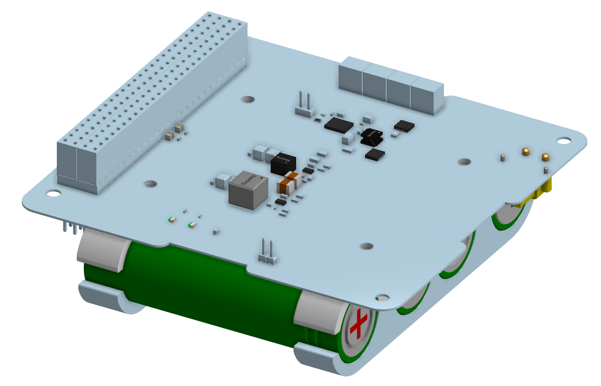

Build command

  pandoc eps_datasheet.md \
    --defaults=/workspace/notes/reports/markdown_to_pdf/pandoc-datasheet.yaml \
    -o eps_datasheet.pdf

  How to use this for the other boards

  Each board's .md file just needs to set its own values via a raw-LaTeX block at the top:

  \renewcommand{\dsproject}{comms}
  \renewcommand{\dssubtitle}{70 cm / 2 m Transceiver}
  \renewcommand{\dsrevision}{rev A}
  \renewcommand{\dstagline}{Half-duplex BPSK TX / AFSK RX ...}
  \renewcommand{\dsorg}{MSU CubeSat -- EMBER}
  \renewcommand{\dsdocrev}{Document Rev 0.1}
  \renewcommand{\dsdate}{May 2026}
  \datasheettitle
  \dsbegin

  Then write body content as normal markdown. Drop \columnbreak where you want column 1 to end. Wrap any tables in raw \begin{tabular}...\end{tabular} (markdown pipe-tables become
  longtable, which doesn't work inside multicols — this is the one thing to remember). Close with \dsend.

  Two known gotchas the template documents

  1. No markdown tables inside multicols — use raw LaTeX tabular (template header has a comment block explaining this).
  2. YAML header-includes doesn't pass through to LaTeX preamble in pandoc 3.x — that's why the per-board \renewcommand overrides live in a body-level raw-LaTeX block instead of YAML
  metadata.

  Cosmetic things you'll probably want next iteration

  - The "Repository" row in Project Info breaks awkwardly (emb / er). Easy fixes: shorten to just ngrabbs/ember (drop github.com/) or widen the value column.
  - Replace [Board photo placeholder] frame with an actual rendered image when one exists. Just drop a PNG into hardware/eps/datasheet/board.png and swap the fbox/minipage block for
  {width=2.5in}.
  - No logo wired up. Set \renewcommand{\dslogo}{path/to/logo.png} once an EMBER mark exists.
  - The custom dscallout color (orange-yellow) is just an aesthetic pick — change in datasheet-header.tex if you want different status-card colors per state (green=verified,
  orange=in-progress, red=fail).

