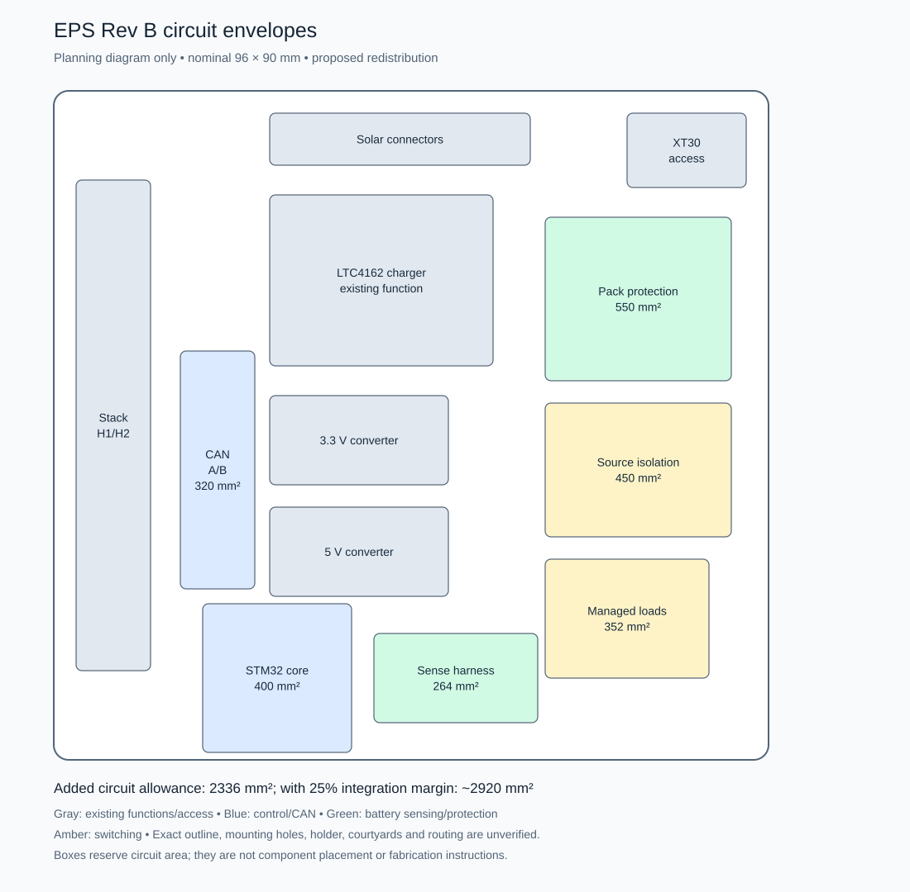

# EPS Rev B pin allocation and circuit fit study

> 2026-10-04 library acceptance finding: the installed `MCU_ST_STM32G0:STM32G0B1KETx` symbol does not match the selected GP MCU at physical pins 17, 20 and 26–29. A disposable KiCad render confirms the conflict. Keep the manufacturer-derived allocation below; do not place that installed symbol in Rev B. See the [package reconciliation evidence](../verification/rev_a_saved_schematic_audit.md). Corrected project-owned symbol and full pad-map acceptance remain required.

Draft dated 2026-10-03. The preferred STM32G0B1KET package can accommodate the proposed EPS interfaces. The added circuits appear compatible with a single PCB after layout changes, but this is an area budget, not verified footprint placement or holder clearance. Use BQ40Z50 as the protection reference for the next circuit-design pass; retain BQ28Z610 as the smaller alternative.

[Architecture plan](rev_b_plan.md) · [EPS documentation](../README.md)

## Inspection basis

Read-only KiCAD CLI exports of the saved `eps.kicad_pcb` produced a front fabrication/courtyard plot, front copper plot, and all-footprint position CSV. The current position export contains 77 footprints. No CAD source was changed. These exports reflect the saved file, not any unsaved editor state or proof of the fabricated Rev A configuration.

The exported Edge.Cuts extrema span approximately 95.98 × 90.18 mm, consistent with the nominal 96 × 90 mm envelope. The SVG page is larger because it also includes drawing extents. These measurements are not a mechanical acceptance. Existing components occupy a central charger/buck region, six upper-edge connectors, left stack headers, and the upper-right XT30 region. Open surface exists to the right and below the conversion circuits, but copper, returns, harness access, and mechanical exclusions must be reworked.

The historical `datasheet/board.png` shows underside cells and holders; it does not establish the current printed holder's geometry. There is no identified current holder CAD or quantified underside clearance in the inspected EPS files. Do not assume the underside can carry new components or treat the old render as the current assembly.

## MCU allocation

Proposed for the general-purpose LQFP32 variant, not the alternate N pinout. Physical pins and alternate functions were checked against [ST DS13560 Rev 6](https://www.st.com/resource/en/datasheet/stm32g0b1ke.pdf), Figure 3 and Tables 12–16. The assignment is board-local and does not authorize changes to stack signals. Full orderable suffix, temperature grade, errata review, and CubeMX confirmation remain open.

| Pin | Port | Proposed assignment | Mode |
|---|---|---|---|
| 1 | PB9 | CAN A standby | GPIO |
| 2 | PC14 | External clock | HSE bypass |
| 3 | PC15 | Reserve input | GPIO |
| 4 | VDD/VDDA | Essential 3.3 V | Supply |
| 5 | VSS/VSSA | Ground | Supply |
| 6 | PF2-NRST | Reset and SWD | Reset |
| 7 | PA0 | PowerPath voltage | ADC0 |
| 8 | PA1 | 5 V voltage | ADC1 |
| 9 | PA2 | Debug TX | USART2 AF1 |
| 10 | PA3 | Debug RX | USART2 AF1 |
| 11 | PA4 | 3.3 V voltage | ADC4 |
| 12 | PA5 | Interlocked battery voltage | ADC5 |
| 13 | PA6 | Managed 3.3 V enable | GPIO |
| 14 | PA7 | Managed 5 V enable | GPIO |
| 15 | PB0 | CAN B RX | FDCAN2 AF3 |
| 16 | PB1 | CAN B TX | FDCAN2 AF3 |
| 17 | PB15 | Payload power request | GPIO |
| 18 | PA8 | Charger alert | Input |
| 19 | PA9 | Pack manager clock | I2C2 AF8 |
| 20 | VDDIO2 | Essential 3.3 V | Supply |
| 21 | PA10 | Pack manager data | I2C2 AF8 |
| 22 | PA11 | CAN A RX | FDCAN1 AF3 |
| 23 | PA12 | CAN A TX | FDCAN1 AF3 |
| 24 | PA13 | SWD data | SWD |
| 25 | PA14 | SWD clock and BOOT0 | SWD |
| 26 | PD0 | Reserve with reset-state restrictions | GPIO |
| 27 | PD1 | CAN B standby | GPIO |
| 28 | PD2 | Hardware interlock status | Input |
| 29 | PD3 | Pack BTP status | Input |
| 30 | PB6 | Charger clock | I2C1 AF6 |
| 31 | PB7 | Charger data | I2C1 AF6 |
| 32 | PB8 | Optional EPS stack alert | Open drain |

There is no duplicate physical pin assignment. PD0 and PC15 remain reserved, with PC15 intended for a low-demand input. CAN A standby uses PB9 to avoid PD0's UCPD-related reset behavior. Four rail measurements, three load requests, two standby controls, both serial buses, both CAN channels, and debugging fit without a GPIO expander. Additional per-load current/fault inputs may consume reserves or require a larger package.

The pack's two protection NTCs connect to the pack manager, and the charger NTC connects to LTC4162, so they consume no STM32 ADC pins. Read battery cell voltages through the pack manager. The STM32 battery divider observes only the interlocked side of the battery feed to avoid crossing the retained-protection boundary. Calibrate rail measurements using a verified reference; measuring the MCU's own supply against that same supply alone is insufficient.

Use separate charger and pack-manager buses so an electrical fault on one does not directly hold the other's lines low. This separation still shares MCU and power. The pack-manager bus and BTP output require power-off isolation. BTP is a battery-trip-point indication, not a universal fault interrupt; obtain protection faults through SMBus polling. The optional stack alert's new MCU-driven semantics require a canonical interface update before routing.

## Clock and reset conditions

The K package provides HSE bypass rather than a crystal oscillator connection. Use the proposed external 16 MHz oscillator feeding PC14; do not fit a passive HSE crystal circuit. The proposed use also excludes an LSE crystal. A 64 MHz system clock remains a candidate, while CAN uses the proposed direct HSE kernel clock below. Full clock-tree setup and full-temperature timing acceptance require hardware checks.

Bring up both CAN controllers at the existing provisional classic-CAN 500 kbit/s. On clock failure, preserve local power supervision and report communication unavailable until valid timing is restored; a shared oscillator failure can affect A and B together.

Keep PA11/PA12 in their default mapping and omit USB from this allocation. Preserve PA14 debugging access while defining BOOT0 option bytes and boot-entry wiring. Power VDDIO2 and all bus-side pull-ups deliberately. Check UCPD reset pulldowns and startup configuration against the selected silicon; external enable and standby resistors must define safe states before firmware runs. Retain SWD reset access for failed-image recovery.

## Dual CAN circuit definition

Select two TCAN3413DR SOIC-8 devices as the schematic candidates, one per bus. Their [TI datasheet](https://www.ti.com/lit/ds/symlink/tcan3413.pdf) specifies 3.3 V supply operation, separate VIO, standby, TXD dominant timeout and high-impedance bus/logic behavior when unpowered. SOIC is the assembly/debug preference; final sourcing and footprint acceptance remain open. Both VCC and VIO come from essential 3.3 V, so recovery does not require stack 5 V or a managed-load enable.

| Transceiver pin | CAN A connection | CAN B connection |
|---|---|---|
| 1 TXD | PA12, FDCAN1 TX | PB1, FDCAN2 TX |
| 2 GND | Essential-domain ground | Essential-domain ground |
| 3 VCC | Essential 3.3 V | Essential 3.3 V |
| 4 RXD | PA11, FDCAN1 RX | PB0, FDCAN2 RX |
| 5 VIO | Essential 3.3 V | Essential 3.3 V |
| 6 CANL | H1.52 `CAN_L` | H2.50 `CAN_B_L` |
| 7 CANH | H1.51 `CAN_H` | H2.49 `CAN_B_H` |
| 8 STB | PB9 | PD1 |

This is a datasheet pin-to-net specification, not an accepted KiCad symbol/footprint mapping. Verify the exact SOIC package pad map before placement. TCAN3414 is not a drop-in equivalent for pin 5.

Propose external 10 kΩ pull-ups on STB and TXD for each channel, subject to leakage and GPIO checks. At reset, standby prevents transmission and TXD is recessive. Firmware first configures recessive TX, the clock, filters and receive queues, then enables each channel. TI distinguishes standby wake indication from normal frame reception; after initialization keep both channels in normal mode for the initial fallback implementation. A later low-power policy requires a tested wake/retry protocol.

Place local 100 nF bypass capacitors at both supply pins and suitable local bulk capacitance per channel. Evaluate the essential regulator under both channels' worst-case traffic and bus faults. A short on one transceiver's supply can still kill shared 3.3 V; bus redundancy alone does not isolate that fault. Determine whether separately current-limited supply branches are necessary after the fault/current budget, and include their area if selected.

Provide separate, normally unpopulated termination options for A and B. Fit a 120 Ω termination only where EPS is an actual physical bus end; otherwise terminate at the two real ends. Select resistor power from sustained differential fault voltage. Reserve low-capacitance CAN protection and optional filtering footprints near the stack interface, then choose their population from transient and signal-integrity tests. No A/B bus wire, termination midpoint or protection path may unintentionally join the channels.

Keep bus routes short with continuous return reference and minimize stubs. Verify unpowered behavior in the assembled circuit, including protection devices and external debug leads. CAN A/B availability still depends on the shared MCU, oscillator and essential power.

## Oscillator and initial CAN timing

Select [ECS-3225MV-160-BN-TR](https://ecsxtal.com/products/oscillators/surface-mount-oscillators/ecs-3225mv-160-bn-tr/) as the oscillator candidate: 16 MHz CMOS, ±50 ppm over −40 to +85 °C, 3.2 × 2.5 mm package. The [manufacturer datasheet](https://ecsxtal.com/store/pdf/ECS-3225MV.pdf) lists pad 1 enable, 2 ground, 3 output and 4 supply; its stability specification includes initial, temperature, supply/load and reflow effects, with aging specified separately.

Power it from essential 3.3 V, bypass locally and tie enable to its supply through a defined pull-up. Route output to PC14 with an optional source-series resistor footprint. Validate output load, logic levels, startup time and duty cycle against STM32 HSE-bypass limits. Include up to 4 mA oscillator consumption from the manufacturer table in the provisional essential budget. Check whether the temperature grade covers the mission before freezing it.

Use the HSE option in the FDCAN clock selector documented by [ST RM0444](https://www.st.com/resource/en/reference_manual/rm0444-stm32g0x1-advanced-armbased-32bit-mcus-stmicroelectronics.pdf). For a 16 MHz FDCAN kernel clock and shared divider of 1, the initial classic-CAN settings are:

| Parameter | Proposed actual value |
|---|---|
| Nominal prescaler | 2 |
| Nominal time segment 1 | 13 time quanta |
| Nominal time segment 2 | 2 time quanta |
| Nominal synchronization jump width | 2 time quanta |
| Total bit time | 16 time quanta, 2 µs |
| Nominal bit rate | 500 kbit/s |
| Sample point | 87.5% |

Calculation: `16 MHz / [2 × (1 + 13 + 2)] = 500 kbit/s`; sample point is `(1 + 13) / 16`. These are actual values, not the minus-one register encodings. Initialize the shared divider consistently before bringing up either controller. Disable CAN FD and bit-rate switching for compatibility with the current classic-CAN bench.

This is an initial timing proposal, not a closed network timing budget. Check peer oscillators, both transceivers' delay, bus length, propagation, resynchronization and worst-temperature tolerance. On HSE failure, suspend CAN transmission until a validated timing source is available; do not reuse the same settings on an assumed fallback clock. Preserve local supervision through a tested clock-failure recovery path.

Before schematic acceptance, confirm the complete allocation in STM32 configuration tools, review device errata, verify external reset/BOOT0 and all power-pin requirements, and accept each physical package map. Bench acceptance includes communication with existing peers, A/B shorts, stuck TXD, peer resets, cross-bus duplicate requests and loss of A while a ground recovery request succeeds over B. No such hardware tests have run in this study.

## Protection circuit recommendation

Use [BQ40Z50-R2](https://www.ti.com/lit/ds/symlink/bq40z50-r2.pdf) as a design reference because its four thermistor inputs can support two independent protection sensors without an external mux. Its BTP output is not a general fault pin. The reference includes charge/discharge FETs, current sensing, precharge and secondary-protection circuitry; it is not just a 4 × 4 mm IC. Internal balancing is limited to 10 mA, so required correction time must be calculated. See sections 9.2.2 and 9.2.2.3.2.

The reference's default configuration is 3S, and the datasheet specifies a commissioning procedure for 1S/2S. Program and verify the actual 2S configuration before normal operation; also calibrate sensing and establish the chemistry/gauging configuration. Do not copy the example protection limits into EMBER.

The [BQ28Z610](https://www.ti.com/lit/ds/symlink/bq28z610.pdf) alternative saves IC area but offers one protection thermistor input. Choose it only after explicitly revising temperature coverage or adding an independent thermal cutoff. A second sensor read only by the STM32 does not provide the same protection coverage with the STM32 unavailable.

The exact BQ40Z50 family revision, protection FETs, shunt, balancing implementation, precharge circuit, secondary protector/fuse, and commissioning tools remain unselected. First compare a complete provisional BOM and courtyards. Gauging accuracy requires pack characterization; it is not established by adding the IC.

## Estimated circuit envelopes

The table below is the initial additions-only estimate. The [2026-10-04 sizing checkpoint](rev_b_power_stage_sizing_and_fit.md) supersedes the converter reservations in the drawing: 432 mm² for the 3.3 V buck and 768 mm² for the 5 V buck-boost, a combined increase of 624 mm². The revised CAN rectangle is 336 mm² (16 mm² larger). The initial 2336/2920 mm² totals below exclude those changes and must not be treated as the current full-board budget.

The operator reports 16 mm top standoff. Usable height still requires the upper board’s underside geometry, reference faces and tolerances. Holder and underside clearance remain open.

These are engineering allowances for front-side layout, not dimensions from a completed BOM. They include nearby passives and local routing allowance. They exclude the existing charger/bucks and most existing connectors. The estimate assumes three initial managed load groups; shared stack rails still require coordinated local switching on consuming boards.

| Addition | Reserved envelope | Area | Included |
|---|---|---|---|
| STM32 core | 20 × 20 mm | 400 mm² | LQFP32, oscillator, reset, decoupling, SWD/UART access |
| Dual CAN | 20 × 16 mm | 320 mm² | Two transceivers, bypassing, protection, optional endpoint termination |
| Pack protection | 25 × 22 mm | 550 mm² | Pack manager, FETs, shunt, sense filters, precharge and secondary-protection allowance |
| Source isolation | 25 × 18 mm | 450 mm² | Battery bidirectional cutoff, solar cutoff, gate drives, interlock interface |
| Managed loads | 22 × 16 mm | 352 mm² | Three preliminary channels and fault/interface allowance |
| Sensing harness | 22 × 12 mm | 264 mm² | Keyed connector, filters, sensor input protection |
| Total additions | — | 2336 mm² | About 27% of a nominal 96 × 90 mm rectangle |

Allow another approximately 25% beyond these envelopes for integration changes, totaling about 2920 mm². This margin is a planning assumption, not a routing utilization measurement. Edge notches, stack headers, mounting and holder constraints reduce usable board area. XT30 access, bend radius and mating clearance remain mandatory mechanical reservations.

The illustrative floorplan places CAN near the stack, protection near the battery connector, power switches alongside the high-current paths, and the MCU away from switching nodes. It redistributes existing circuit groups; it does not preserve Rev A routing. Proposed source-isolation and load-switch envelopes may grow once current ratings and hazard analysis are known.

This drawing is a nominal rectangle with planning envelopes, not the exact Edge.Cuts, courtyards, connector geometry, or a validated placement. No routing, creepage, thermal or mechanical check is implied.

## Layer recommendation

Recommend four layers for Rev B, subject to fabrication and mechanical review. The extra protection, power domains, two CAN interfaces, and digital sensing make continuous ground returns and routing separation more valuable. Keep the same single-board form factor. Final thickness, copper weight, stackup, switching-loop layout, and thermal paths still require acceptance.

Two layers remains an option if cost requires it, but it should be selected after a real placement/routing trial. Existing free surface and a heavier copper option alone do not establish routing or thermal feasibility. Do not use the area estimate as a reason to shrink essential filtering or protection.

## Next circuit design pass

1. Build a provisional BQ40Z50 2S circuit and commissioning specification from the selected family revision's reference, including independent temperature sensing and fault recovery.
2. Select battery/solar isolation topology and load switches after defining voltage/current envelopes, inrush and RBF contact behavior.
3. Select CAN transceivers and the oscillator; check reset states, electrical compatibility and power-off behavior.
4. Obtain holder geometry and board-to-cell clearance; reconcile the reported 16 mm top standoff with upper-board underside protrusions and mechanical tolerances. Confirm harness access and whether the current saved outline includes all required mounting features.
5. Check the complete BOM's actual courtyards against a proposed placement before schematic or fabrication freeze.

The present outcome is a feasible pin budget and plausible circuit-area budget. Physical fit, final parts, startup recovery and flight inhibit acceptance remain unverified.
