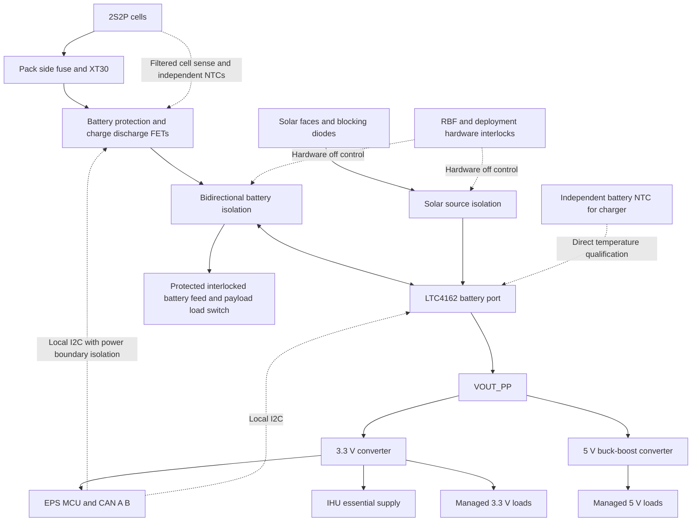

# EPS Rev B architecture and implementation plan

Draft dated 2026-10-03. This plan defines a single-board EPS revision with independent battery protection, hardware power isolation, an STM32 supervisor, and CAN A/B access. It records agreed requirements and proposed implementations separately. It is not a schematic, a parts freeze, or flight acceptance.

[EPS documentation](../README.md) · [Stack pin authority](../../../system/interfaces/cskb_pinmap.md) · [Inhibit architecture](../../../docs/architecture/inhibit_and_deployment.md)

The [provisional BOM and schematic checklist](rev_b_bom_and_schematic_checklist.md) consolidates circuit candidates, power-stage reuse conditions, proposed sheet organization and implementation checks. Use it as the handoff; this plan remains the architecture authority.

The [pin allocation and circuit fit study](rev_b_pin_and_fit_study.md) establishes a provisional LQFP32 allocation and circuit-area budget. It recommends BQ40Z50 as the protection reference and four layers for evaluation; physical fit and final component selection remain open.

Its controller circuit definition selects two essential-3.3-V TCAN3413DR transceiver candidates and a 16 MHz ECS oscillator candidate, with initial 500 kbit/s timing. CAN A standby now uses PB9; PD0 is reserved to avoid using its UCPD-related reset behavior for that control. Package maps, clock/reset checks and bench acceptance remain required.

The [source-isolation study](rev_b_source_isolation_study.md) recommends evaluating separate back-to-back P-channel pairs with direct hardware interlock control. It includes preliminary loss calculations and identifies depleted-pack recovery, inrush and cold solar voltage as unresolved acceptance gates.

The [source voltage and fault budget](rev_b_source_voltage_and_fault_budget.md) derives a typical 32.164 V cold 4S Voc and recommends higher-voltage buck stages plus autonomous solar OV isolation inside the RBF boundary. Exact limits, circuit selections and fault-energy coordination remain open.

The [BMS and temperature specification](rev_b_bms_and_temperature_spec.md) defines the 2S protection circuit boundary, three independent sensors, configuration/readback requirements and simulator verification sequence. It explicitly assigns TS1 and TS2 to cell protection and keeps charger and BMS thermistor models separate.

The [regulator and OV candidate study](rev_b_regulator_and_ov_candidates.md) carries forward LMR51635XDDCR for 3.3 V and LM5177DCPR for 5 V evaluation. The operator selected regulated 5 V for COMMS recovery down to the provisional 5 V pack floor, so the 5 V stage is buck-boost. Complete stages, fit and cutoff trip/reset windows remain unaccepted.

## Agreed requirements

| Subject | Working requirement |
|---|---|
| Packaging | One EPS PCB; no battery protection daughterboard. Preserve a removable pack and the existing mechanical envelope. |
| Storage | 2S2P LG MJ1 baseline. Current pack uses a printed holder, directly soldered wires, and XT30. New pack construction should use professionally welded tabs. |
| Current | Operator estimates battery load at 2 A or more. Continuous, peak, startup, and charge currents remain unmeasured. This is not a 2 A cutoff specification. |
| Power isolation | RBF insertion shuts down powered spacecraft functions, including charger and EPS MCU. Deployment switches also enforce hardware shutdown while stowed. |
| RBF access | Exit through a spacecraft side; the side and location may be chosen to suit the EPS, structure and dispenser. Design the mounting and access arrangement rather than relying on an existing opening. |
| Authority | EPS owns autonomous protection and load shedding; IHU requests operating states. IHU requests cannot override hardware interlocks or protection. |
| Controller | STM32G0B1KE is the preferred MCU, pending package pin allocation. |
| Communications | Separate CAN A and B. A is primary; B must provide recovery access after A fails. |
| Rev A | Inspect damaged thermistor area later. Do not treat the current reworked circuit as a reference implementation. |

## Evidence and unresolved Rev A faults

Rev A uses LTC4162-L and two TPS62933F bucks, with a 4S solar string per face. The older EPS overview still names TPSM5D1806 and an earlier solar configuration; it is not the next revision's component authority. Reconcile assembled hardware, fabrication BOM, current CAD, and documentation before carrying over reference designators or networks.

The [bench record](../../../system/ground_station/eps_bench_setup.md) reports that replacing the faulty input resistor with a wire jumper resolved the measured VIN discrepancy. Charging remained in NTC pause, with no real battery thermistor fitted and no charging observed in the timed experiment. The operator subsequently reports damaged traces around the attempted thermistor repair. The thermistor circuit is the leading charging-blocker hypothesis, not a confirmed sole fault. Buck load, ripple, thermal, and transient qualification also remains incomplete.

## Proposed power architecture

Retain LTC4162 PowerPath and the two buck functions provisionally. Add battery protection and source interruption ahead of the charger, and distribute only protected, interlocked power to the stack. All labels below are conceptual board-local domain names; they do not allocate new stack nets.

Battery isolation must conduct charging and discharge when enabled and block both directions when off. A single MOSFET body diode must not bypass shutdown. Solar isolation must stop illumination from powering the charger or loads while inhibited. Evaluate separate common-source P-channel MOSFET pairs with hardware contact loops as the starting topology. Exact switches, gate networks, voltage ratings, discharge paths, leakage limits, and failure response remain design work.

The protection IC and its required cell-sense circuitry form the only proposed retained powered domain. Their communication and fault outputs must not back-power the EPS MCU or downstream rails. Use interfaces with verified power-off isolation; do not assume a pull-up or series resistor alone establishes this. Charger battery sensing and auxiliary supplies must land on the correct side of isolation or be independently isolated.

The existing H2.45/H2.46 `VBAT` feed must become protected and interlocked rather than remain an unrestricted raw cell feed. Preserve the canonical pin assignment; update its voltage-domain description and coordinate every consumer before implementation. The managed-load proposal below adds an EPS-side switch to this feed while retaining the payload's local converter enable.

This conservative proposal turns off charging during RBF or deployment-switch inhibition. An external charging exception would require a separate reviewed design; it is not included here. USB, SWD, UART, external supply connectors, CAN logic, and signal harnesses must be included in the back-power audit.

## Side access RBF implementation proposal

The operator permits selecting any side for RBF access. Recommend a removable pin passing through a guided side-wall opening to actuate a mechanically supported switch near the EPS perimeter. Attach the guide/bracket to the structure so insertion force and pin bending do not load PCB solder joints. A short retained harness to EPS is acceptable and does not require another PCB. Prefer a replaceable mechanism over using a loose electrical jumper as the flight RBF.

Choose the side after checking solar-panel coverage, rail exclusions, antenna hardware, battery-holder clearance, stack spacing and tool/finger access. Reserve an EPS edge connector and a mechanical exclusion around the pin's full insertion travel; exact dimensions require a selected switch and structure model. Keep the pin away from cells, exposed conductors and harnesses, with a positive insertion stop and clearly distinguishable fully inserted position. Define retention and extraction force and verify them through handling and environmental tests.

[CDS Rev. 14.1](https://www.nasa.gov/wp-content/uploads/2018/01/cubesatdesignspecificationrev14_12022-02-09.pdf), §§2.3.4–2.3.5, limits fully inserted RBF protrusion to 6.5 mm from the rail surface and requires compatibility with dispenser access ports when available. Some dispensers require removal before insertion. Side selection is flexible now, but final port alignment, pin travel and handling procedure depend on the dispenser and launch provider.

Prefer the mechanical contacts to control hardware source-isolation gate circuits rather than carry the full spacecraft discharge/charge current. This is an engineering proposal, not a selected or qualified circuit. Derive each gate circuit's operating power from the appropriate upstream source so neither requires a running MCU or an already-enabled downstream rail. Review bias leakage and the permitted retained-power boundary. With pin inserted, both battery and solar paths must be off; the MCU only observes status when it has power.

| RBF state | Required deployment switches | Source-isolation permission |
|---|---|---|
| Inserted | Any state | Off |
| Removed | Any required switch actuated | Off |
| Removed | All required switches released | May turn on, subject to protection and startup conditions |
| Harness open or connector unplugged | Any state | Off by hardware default |

Use an enable-loop arrangement that opens when inhibited, with gate defaults that enforce off when the loop is open. Confirm contact selection and pin-actuation direction against the actual mechanism. Analyze welded contacts, shorts across contacts, harness shorts, leakage, brownout and switch bounce separately; an open-wire default does not make every failure safe. Re-actuation must remove power promptly and restore the prelaunch timer state. RBF removal alone must never authorize RF or antenna release.

Acceptance evidence must include battery-only, solar-only and combined-source shutdown; harness-disconnect behavior; all external back-power paths; residual rail discharge; repeated insertion/removal; and alignment/retention under the relevant mechanical loads. The source switches are part of the whole-spacecraft shutdown design, while independent RF and release barriers remain owned by the inhibit architecture.

## Battery protection comparison

The following capabilities come from TI datasheets; suitability assessments are engineering judgments. Package size does not include FETs, shunt, filtering, balancing parts, or routing space.

| Candidate | Documented features | Assessment for EMBER |
|---|---|---|
| [BQ28Z610](https://www.ti.com/lit/ds/symlink/bq28z610.pdf) | 1S to 2S gauge/protector, high-side FET drive, balancing, one external thermistor input; 12-pin 4 × 2.5 mm VSON | Compact shortlist candidate. One protection thermistor does not satisfy the proposed two-group protection sensing without additional circuitry or a revised requirement. |
| [BQ40Z50-R2](https://www.ti.com/lit/ds/symlink/bq40z50-r2.pdf) | 1S to 4S pack manager, high-side FET drive, balancing, SMBus, up to four external thermistors; 32-pin 4 × 4 mm QFN | Preferred functional reference because it supports multiple protection sensors. Larger circuit and configuration effort must fit the board. Final family revision is open. |
| [BQ76905](https://www.ti.com/lit/ds/symlink/bq76905.pdf) | 2S to 5S monitor/protector, low-side FET drive, one external thermistor, host-controlled balancing | Alternative if gauging is unnecessary. Low-side switching complicates return-path analysis, and balancing requires STM32 participation. |

Shortlist BQ40Z50 and BQ28Z610 first. Do not order a final production part until the complete circuit area, configuration tools, cell characterization, standby consumption, recovery behavior, and temperature coverage have been compared. Prefer high-side protection to reduce the risk of ground paths bypassing a low-side disconnect; any current-shunt return still requires analysis.

Configure protection so essential limits operate without the STM32 or IHU. Verify shipped defaults, programmed configuration, retained settings, and behavior before configuration completes. Define cell overvoltage/undervoltage, charge/discharge overcurrent, short circuit, temperature limits, balancing limits, and recovery from each fault. No numeric trip settings are assigned by this draft. Secondary protection requirements remain open under the launch/battery acceptance process.

## Battery harness and temperature sensing

Retain XT30 provisionally for main power. Provide a separate keyed connector for filtered cell sensing and independent thermistors. A 2S pack has three cell-voltage nodes: bottom, series midpoint, and top. The two parallel cells within a group share voltage; the protection IC does not independently measure all four cells. Sense-wire protection and connection order must follow the selected reference design, including any balancing current carried by the sense harness.

Fit a pack-side fuse close to the cells to protect the harness before PCB protection. Fuse rating requires actual load peaks, wire sizing, fault current, and coordination with PCB protection. PCB protection is unavailable while the pack is disconnected. Define insulation, strain relief, retention, connector polarity, storage, and assembly inspection with the mechanical design.

Propose three independent NTCs: one for LTC4162 charge qualification and two for pack protection, observing the two series groups. Thermal placement must cover the cells most likely to reach temperature extremes; sensing one cell does not prove its parallel partner is at the same temperature. Reserve additional protection sensing if thermal testing requires it. The three-sensor proposal is not a frozen connector pin count.

The [LTC4162-L datasheet](https://www.analog.com/media/en/technical-documentation/data-sheets/LTC4162-L.pdf), p. 20, specifies an NTC from `NTC` to ground and a bias resistor from `NTCBIAS` to `NTC`, equal to the NTC resistance at 25 °C. Select the NTC curve and qualification thresholds together. Do not share a thermistor between independently biased circuits. No fixed dummy resistor or software temperature bypass belongs in normal operation.

Require charging inhibition for disconnected, shorted, out-of-range, or implausible temperature sensing, with the actual response verified for each selected device. Review protections while the host is held in reset. Bench tests should first use a cell simulator and resistor substitution, then controlled temperature tests with real sensors and a protected pack.

For a new pack, use professionally welded tabs rather than reheating existing cell terminals. [Panasonic lithium-ion guidance](https://eu.industrial.panasonic.com/sites/default/pidseu/files/downloads/files/panasonic_li-ion_handbook.pdf) prohibits direct soldering to cells; this is general assembly guidance, not an inspection result for the current LG pack. No Rev A pack rework is required to complete this plan.

## Controller startup and load ownership

The [STM32G0B1KE datasheet](https://www.st.com/resource/en/datasheet/stm32g0b1ke.pdf) documents two FDCAN controllers and package-specific alternate functions. Complete a 32-pin allocation for both CAN channels, local I2C, charger alert, protection status, load enables, rail measurements, UART, reset, and SWD before freezing the package. Move to a larger package in the same family if the allocation cannot preserve these functions and debugging access.

Proposed startup behavior:

1. With RBF inserted or a required deployment switch actuated, source isolation remains off without executing firmware.
2. Hardware interlock release permits the source path and essential 3.3 V supply to start. The EPS MCU must not need to enable the supply that powers itself.
3. EPS boots with nonessential loads off, initializes both CAN interfaces, reads protection and charger status, and publishes valid or explicitly unavailable measurements.
4. IHU boots from the essential supply. EPS admits requested loads only after local checks pass. Distinguish a valid power-source state from missing telemetry.
5. Persistent undervoltage or other faults shed nonessential loads before hard pack cutoff. The independent protector remains the final barrier.

Essential means preserved during operational load shedding; it does not mean powered through RBF. CAN loss alone must not switch off EPS or IHU. MCU reset/watchdog recovery must leave nonessential enables in defined states and must not produce an antenna burn or RF permission.

A depleted-pack recovery must allow solar energy to reach the charger, qualify the pack, and recover from permitted protection states without relying on an already-running MCU. Validate charger/protector detection and body-diode behavior using simulators before connecting a real depleted pack. Define startup hysteresis to avoid repeated boot-collapse cycles under weak solar input.

Shared stack rails cannot independently isolate consumers at EPS. The following load-control proposal preserves IHU power and uses local switches where the existing stack has no separate feed. IHU power cycling remains a separate recovery feature to evaluate; it is not included in the initial three managed-channel allowance.

## Managed loads and recovery power

Recommend retaining the shared stack 3.3 V supply for essential consumers and placing payload auxiliary and COMMS transmit switches on their consuming boards. Add an EPS-side switch on the protected, interlocked battery feed to the payload. This is a proposed distribution design, pending circuit review and measured currents; it does not change existing pin assignments or signal ownership.

| Load group | Proposed switching location | Startup and shedding policy |
|---|---|---|
| EPS MCU, both CAN interfaces, IHU | Essential supply after hardware source interlocks | Start automatically when power is available; preserve during ordinary shedding. RBF and independent pack protection still remove power. |
| COMMS controller, recovery CAN and receive path | Local essential branches of shared rails | Retain a ground recovery path in safe mode if its measured consumption fits the budget. Transmit permission starts disabled. If continuous receive is too expensive, define scheduled receive windows and an autonomous wake mechanism. |
| Jetson main converter | EPS-side switch ahead of H2.45/H2.46, plus existing payload buck enable | Default off; EPS admits a bounded operating interval. Shed on low energy or local fault. Existing IHU `PAYLOAD_EN` still controls the local buck within EPS permission. |
| Cameras and payload auxiliary electronics | Payload-local switch downstream of shared 3.3 V | Default off for nonessential branches; sequence with Jetson power according to module and peripheral requirements. Keep only an explicitly budgeted control interface alive if needed. |
| COMMS transmit circuitry | COMMS-local switch or verified local power gating | Default off; admit transmit windows only when energy and independent RF inhibits permit. Disabling TX must preserve required receive/control circuitry. |

The [payload carrier record](../../payload_compute/design/payload_carrier_pinmap.md), §§6.2–6.4, assigns Jetson converter power to `VBAT`, but cameras, interface parts and the bench-only M.2 socket to stack 3.3 V. Cutting the battery feed alone therefore does not power down the whole payload. The same record says stack 5 V is unconnected on the carrier, despite the broader consumer marking in the canonical map. Reconcile the actual circuits before changing that authority. Its current figures are design estimates, not measurements.

Switching H2.45/H2.46 also removes the voltage seen by the COMMS battery-monitor tap. Treat that reading as switched-feed voltage, not cell voltage. Ground battery telemetry should come from EPS with validity and provenance preserved. Before assigning any other consumer to this feed, account for the fact that the switch controls both parallel pins together.

The initial three logical groups are Jetson main power, payload auxiliaries, and COMMS TX. They are not three confirmed EPS-resident switch circuits. The pin study's managed 3.3 V and 5 V enables and floorplan allowance remain reservations: local permission distribution has no selected physical interface yet. Do not drive the IHU-owned `PAYLOAD_EN` or `COMMS_EN` pins from EPS. Carry requests and permissions over CAN, and separately design a local default-off response to stale permission, controller reset, or bus loss. If a hardwired EPS veto is required, allocate it through the canonical interface review. A CAN permission is not an independent RF inhibit.

Proposed normal operating sequence:

1. EPS and IHU start, and COMMS enters its recovery configuration. Nonessential groups remain off until EPS has enough valid information to admit them.
2. IHU requests an explicit load state or operating window over either CAN bus. EPS returns acceptance or a reason for rejection; acceptance is separate from confirmation that the rail actually rose.
3. Enable one load group at a time and check settling, voltage droop and available fault status before admitting the next. Determine the payload's rail order from its module/carrier requirements; do not infer it from this table.
4. For planned payload shutdown, IHU requests operating-system shutdown and obtains completion evidence within a bounded time. SC7 sleep and `PAYLOAD_FAULT_N` alone are not shutdown-complete acknowledgments. Then disable the main converter/feed and auxiliary groups in the validated order.
5. EPS sheds the payload first when energy reserve is low, and restricts TX next while preserving recovery access where possible. Serious electrical faults cause immediate affected-channel cutoff. RBF and pack protection act without waiting for software shutdown.

After a trip, latch the affected load off until a defined recovery check passes. Limit retries and require recovery hysteresis so a failing payload cannot repeatedly collapse essential power. An EPS reset returns its managed outputs to off; local-board resets also remove nonessential permission. Losing both CAN paths must leave EPS/IHU recoverable while nonessential operating windows expire under the agreed policy. Exact timeouts and voltage thresholds require the current/energy budget.

For switch selection, require voltage and transient margin, default-off enables, controlled inrush, fault response, thermal margin, and a discharge strategy compatible with the attached load. Validate output-to-input current paths in both powered and unpowered states. [TI's reverse-current application report](https://www.ti.com/lit/an/slva730/slva730.pdf) shows that blocking behavior depends on topology and device operating conditions; a generic load switch designation does not prove isolation. Signal interfaces also need power-off analysis: [TI SCDA015](https://www.ti.com/document-viewer/lit/html/scda015) describes back-power through signal protection paths. Check I2C, CAN, UART, GPIO, cameras and external bench connections with the payload off.

Before setting ratings, measure each group's idle, active, startup and peak consumption, input capacitance, and acceptable rail droop. The [power model](../../../analysis/power/power_budget.py) currently uses a 200 mW placeholder continuous load, so its positive-energy result cannot establish a payload duty cycle. For illustration only, a 15 W converter output at an assumed 90% efficiency draws about 2.8 A from a 6.0 V feed, before other loads. The user's 2 A or more estimate is therefore not a sufficient peak-current rating. Use measured mode power, usable pack energy and orbit-average harvest to set operating windows.

## CAN fallback proposal

Use classic CAN at the existing provisional 500 kbit/s bench rate. Map FDCAN1/2 to separate transceivers and existing A/B stack allocations after updating the canonical map to include EPS. Preserve `CAN_H`/`CAN_L` on H1.51/H1.52 and `CAN_B_H`/`CAN_B_L` on H2.49/H2.50. Each bus needs termination at its actual two ends; do not add termination on every board.

A carries normal traffic. B remains powered and able to receive recovery requests, with periodic bidirectional health exchanges; it must not wait for an A command to become available. EPS and IHU accept authorized requests on either bus and reply on the receiving bus. Only routine telemetry preference changes during failover, so nodes need not switch in perfect synchrony.

Use application replies and heartbeat age as well as controller error state. Physical CAN acknowledgment is not proof the intended node acted. Define bounded detection time, retry count, and recovery dwell from measured traffic and mission needs. After switching to B, latch the preference until A demonstrates stable recovery; exact timing is TBD.

Commands carry source identity, boot/session identity, request identifier, and requested action. Deduplicate across both buses. Use idempotent state-setting commands where possible; power-cycle requests need bounded replay handling across resets. Return accepted, rejected, completed, or unknown outcomes accurately. A timeout does not authorize repeating a non-idempotent action blindly.

To reach EPS/IHU from the ground with A failed, COMMS also needs B hardware and firmware. The current one-channel Feathers demonstrate transport groundwork but not A/B redundancy. A/B still shares each node's MCU, firmware, supply, connector system, and possibly clocks; it is bus-path redundancy, not full controller redundancy. Verify behavior under bus shorts, stuck transmit signals, partial disconnects, peer resets, asymmetric failures, and traffic saturation.

Keep LTC4162 I2C local to EPS in the proposal. Do not connect a second charger master through the existing stack I2C without an explicit ownership/isolation design. Preserve raw charger diagnostics and telemetry validity semantics from [POWER_STATUS v1](../../../system/protocols/eps_power_status_v1.md); allocate EPS-native provenance and commands before implementation.

## Requirements boundary

[CDS Rev. 14.1](https://www.nasa.gov/wp-content/uploads/2018/01/cubesatdesignspecificationrev14_12022-02-09.pdf), §§2.3.1–2.3.8, requires RBF power removal, deployment-switch electrical isolation, battery protection addressing imbalance, and independent RF/deployable inhibits. Powered battery protection may be permitted; this is not an approval for the proposed retained domain. Launch-provider requirements supersede CDS. Existing [inhibit architecture](../../../docs/architecture/inhibit_and_deployment.md) owns deployment timing and hazard-barrier analysis.

RBF/deployment source switches in this diagram do not establish three independent RF or antenna-release barriers. MCU commands and timers must not be counted as physical inhibits. Final RBF mechanism, switch count, contact polarity, mounting, access, and common-failure analysis remain open.

## Implementation sequence and acceptance

| Stage | Work | Exit evidence |
|---|---|---|
| 1 Architecture closure | Fit protection circuits and MCU pin budget; define loads, current envelope, power domains, interlocks, and interfaces | Reviewed block diagram, space estimate, source-path analysis, and resolved design choices |
| 2 Battery circuit bench | Evaluate protection and NTC networks with cell simulator; program/read back configuration | Independent fault cutoff, both series-group readings, sensor fault behavior, balancing, and recovery verified with host reset |
| 3 CAN bench | Exercise dual interfaces on EPS/IHU/COMMS prototypes | A-failure recovery over B, duplicate-command prevention, reset recovery, and bounded error handling |
| 4 Schematic implementation | Reconcile Rev A; implement verified circuits through Konnect; update shared interface authority | ERC review, pin/footprint verification, rendered schematic, power-off back-feed review |
| 5 Layout and fabrication | Resolve 2 versus 4 layers, copper weight, holder/connector clearance, thermal layout, and source/load routing | DRC, mechanical fit, thermal/current calculations, assembly BOM and fabrication package |
| 6 Rev B acceptance | Bring up protection, interlocks, charger, rails, controller, and communication in that order | Measured load/ripple/transient/thermal results; all-source shutdown and depleted-pack recovery; injected CAN failures |

Keep charger-enable testing separate from protection acceptance. A working charge cycle does not establish safe pack protection, and an EPS packet received on the ground does not qualify the power hardware.

## Decisions required before schematic implementation

- Select pack manager after complete area and configuration review; decide whether two independent protection NTCs remain a requirement.
- Measure/estimate continuous and peak discharge, charge current, payload startup, and minimum usable pack voltage; set thresholds afterward.
- Select the side-access RBF mechanism, structural bracket and deployment switches; implement source isolation with a reviewed retained-protection boundary.
- Confirm the proposed Jetson, payload-auxiliary and COMMS-TX groups; design local permission/default-off interfaces and reconcile actual rail consumers with the canonical map.
- Complete STM32 package pin allocation and A/B upgrades for IHU and COMMS.
- Resolve board layer count, component-side clearance against the holder, and harness connection/retention details.

This file owns the Rev B planning checklist. Link to it from broader TODOs rather than duplicating the work list. Existing canonical pin assignments and Rev A documentation remain unchanged until the corresponding implementation decision is made.
