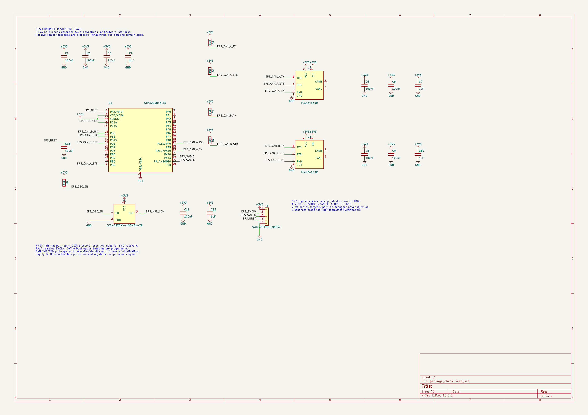

# EPS verification checkpoint

This directory records the Rev A audit and the isolated Rev B controller study. It is a design checkpoint, not a qualified schematic or fabrication release. The fabricated Rev A KiCad files are unchanged by this PR.

- [Rev A saved-schematic audit](rev_a_saved_schematic_audit.md): release/export disagreement and unresolved charger thermistor diagnosis. Physical measurements remain necessary.
- [STM32 GP candidate verification](stm32_gp_candidate_verification.md): package-specific pin mapping and manufacturer-pattern checks.
- [CAN and oscillator package candidates](controller_package_candidates.md): package review and historical verification snapshots.
- [Current controller support draft](controller_support_draft.md): decoupling, reset and control-pin bias, exact endpoint verification and remaining work.
- [Current SWD access draft](controller_debug_draft.md): logical debugger interface, endpoint checks and diagnostic disagreement.
- [Candidate library status](../libraries/README.md): active draft IDs and acceptance limits.

## Current result

The current controller-debug netlist matches the intended endpoints on all 13 named nets. The earlier support-only checkpoint covered 11 nets. Konnect reports zero floating wire endpoints and zero merged named nets. Manufacturer-pattern exports were checked for all 44 pads across the MCU, two CAN transceivers and oscillator.

Current ERC reports **24 errors**; its unconnected/power classification disagrees with component-query coverage as documented in the SWD report. The earlier 26-error support-only and 48-error signal-only results are historical. The physical debug connector and recovery tests, remaining MCU interfaces, CAN connector/termination/protection, source isolation, regulation, final parts and layout remain unfinished. No bench or firmware qualification has run.

## Review previews

[Controller support PDF](previews/package_check_controller-support-draft_1791114867.pdf).

The previews were exported from a disposable study outside the repository. This PR includes its candidate libraries, saved netlists and verification evidence, but does not include the scratch native schematic/PCB. The scratch PCB is a package comparison and is not synchronized with the support schematic or suitable for fabrication.

Machine-readable exports and readbacks are under [evidence](evidence/). Local scratch paths in individual reports record provenance; use the repository previews above for review.
