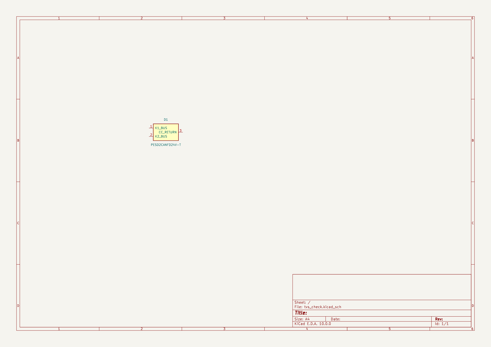
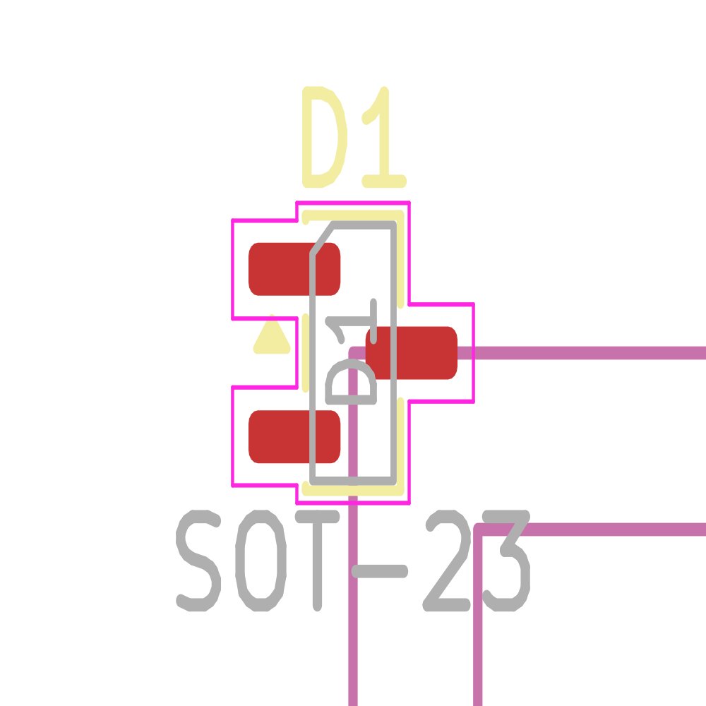

# CAN TVS candidate: pin-map check and fault review

2026-10-04. **Decision: retain PESD2CANFD24V-T as a study candidate; do not place it into the controller circuit yet.** Pin/pad identity was checked in a separate Konnect-created disposable project. Assembly geometry, library defaults and protection coordination remain incomplete. The current controller still has 20 documented ERC errors and no external TVS.

## Authority and identity

Nexperia PESD2CANFD24V-T, SOT23/TO-236AB. [Manufacturer datasheet v.4, 11 August 2020](https://assets.nexperia.com/documents/data-sheet/PESD2CANFD24V-T.pdf): pinning p.2, application p.7, package p.9 and soldering p.10. These pages were rendered and inspected. Download SHA256: `ca36f3ab77f4d80df544458bda6c0a919a9322fbd384aa0865937484fdb892de`.

Symbol: `Ember_EPS_Protection:PESD2CANFD24V_T_DRAFT`, a functional rectangle with passive pins; it does not depict the internal diode network. Comparison footprint: installed `Package_TO_SOT_SMD:SOT-23`. The library search found no PESD2CAN symbol, so the symbol was authored through Konnect. Footprint defaults and description remain empty in the library; the scratch instance has an explicit footprint and exact device value.

The package plan has lead 1 bottom-left, 2 bottom-right and 3 at the opposite-row center. Viewed from the component side, rotating that drawing clockwise 90 degrees puts 1 upper-left, 2 lower-left, 3 right-center, matching the comparison footprint. This is a rotation, not a reflection. There are three physical leads, three passive symbol pins, three unique electrical pads, no exposed pad, duplicates, mechanical pad or drill.

| Lead/function | Symbol number/name/type | Comparison pad | Local X/Y mm, KiCad component-side view |
|---|---|---|---|
| 1, K1 bus | 1 / K1_BUS / passive | 1 | -0.9375 / -0.950 |
| 2, K2 bus | 2 / K2_BUS / passive | 2 | -0.9375 / +0.950 |
| 3, common cathode/return | 3 / CC_RETURN / passive | 3 | +0.9375 / 0.000 |

Query-back and an independent IPC-2581 export agree on numbering, centers, 1.475 × 0.600 mm rounded lands, 0.150 mm corner radius and upper-left pin-one orientation. IPC uses the opposite Y sign; conversion is recorded. Pads use F.Cu/F.Mask/F.Paste. Rendered symbol/board inspection confirms the intended arrangement and footprint key. The exported board detail includes frame artifacts; it is comparison evidence, not a layout.

The installed footprint differs from Nexperia's reflow land/paste drawing. Do not describe it as the manufacturer pattern. Land length, body/lead tolerance coverage, mask, paste, courtyard and assembly process require explicit acceptance or a manufacturer-pattern candidate before integration.

[Readback](evidence/2026-10-04_tvs_readback.json) · [IPC-2581](evidence/2026-10-04_tvs_package-ipc2581.xml) · [verified pads](evidence/2026-10-04_tvs_pattern_verified.json) · [scratch netlist](evidence/2026-10-04_tvs_candidate.net).

## Electrical decision

The datasheet gives 24 V standoff and 42 V maximum clamp at 1 A with the specified 8/20 µs pulse. **That value is not an ESD peak limit.** Its p.6 ±8 kV waveforms visibly overshoot the [TCAN3413](https://www.ti.com/lit/ds/symlink/tcan3413.pdf) ±58 V absolute bus limit during the initial spike. A simple 42-versus-58 subtraction cannot qualify the pair. TCAN3413 also has its own stated IEC ESD capability; decide the required external-protection level before adding parasitics and fault paths.

Overshoot does not by itself prove this combination fails: the transceiver's transient response, both polarities, source waveform, layout inductance and return bounce must be tested together. It does invalidate an acceptance claim based only on the slower pulse clamp specification.

| Fault case | Design conclusion / required evidence |
|---|---|
| Normal traffic, unpowered EPS | Measure loading/leakage, waveform and back-power behavior across temperature with all peer nodes. |
| Short to 2S pack or 5 V | Illustrative 8.4/5 V cases lie below 24 V standoff; the TVS does not clear the fault. Termination and driver fault dissipation remain separate. |
| Short to solar/PowerPath | Its envelope is unresolved. Above standoff, sustained TVS conduction can impose heat and shared-ground current. Define source impedance/current and clearing time. |
| ESD/surge | Test peak and pulse energy at the transceiver pins, with final trace/return geometry and both polarities. |
| Failed-short TVS on A | A may be held low; verify B recovery while measuring shared-ground/supply disturbances. Separate packages alone do not prove independence. |

Current-limit and fuse coordination must use the complete path. The transceiver's driver current limit does not limit current from an external power rail into a TVS. Raising TVS standoff may help a continuous fault while worsening transient clamp coordination; select from the accepted fault envelope, not voltage labels alone.

For the next design pass, keep one independent protection allowance per bus near its stack entry, no shared A/B suppressor package, and short local returns. Keep actual TVS population pending. Close the maximum solar/PowerPath voltage and branch fault response alongside the termination-power selection. This decision does not block the remaining low-voltage MCU interfaces.

## Disposable previews

Scratch project: `/Users/nick/Documents/ChatGPT/EMBER/eps-rev-b-study/tvs-check-2026-10-04/tvs_check.kicad_pro`. Its native files are outside the PR; this PR carries the draft library and exported comparison evidence. The fabricated CAD and controller circuit were unchanged; only the separate disposable study and its library/evidence were added.
