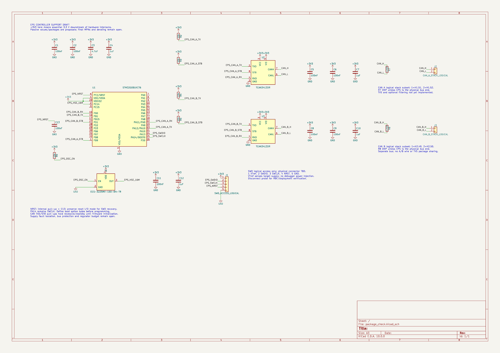

# Controller CAN stack-interface draft

2026-10-04. Added through Konnect to the disposable controller study, extending the [SWD checkpoint](controller_debug_draft.md). The fabricated Rev A CAD remains unchanged.

## Connections and termination options

The bus labels preserve the [canonical CSKB pin map](../../../system/interfaces/cskb_pinmap.md) and [linear dual-bus plan](../../../system/interfaces/board_to_board.md). J2/J3 are logical two-contact subsets only: they are not new physical connectors, and their local pin numbers do not replace the full H1/H2 numbering. Full stack symbols and footprints remain to be integrated.

| Net | Transceiver | Logical interface | Intended full stack contact | Optional termination contact |
|---|---|---|---|---|
| CAN_H | U2.7 | J2.1 | H1.51 | R7.1 |
| CAN_L | U2.6 | J2.2 | H1.52 | R7.2 |
| CAN_B_H | U3.7 | J3.1 | H2.49 | R8.1 |
| CAN_B_L | U3.6 | J3.2 | H2.50 | R8.2 |

R7/R8 propose 120 Ω, with explicit exported Population=DNP properties and on-sheet notes. They must remain unpopulated unless EPS is at the respective bus's physical end. This custom field documents assembly intent; it is not a native KiCad DNP flag or a validated manufacturing-export filter. Enforce the population choice in the final BOM/assembly workflow.

[TI TCAN3413 SLLSFS8A](https://www.ti.com/lit/ds/symlink/tcan3413.pdf), section 8.2.1.1 p.24, describes 120 Ω at each physical bus end. Single-resistor termination is the initial option; split termination and common-mode filtering await measured EMC/signal-integrity need. Do not connect a split midpoint between A and B.

The actual board order and end-node population are not established. Before commissioning, inspect both physical ends separately on A/B. Two fitted 120 Ω terminations give about 60 Ω across an unpowered isolated bus; account for other attached circuitry during measurement. Do not fit every board's termination option.

Exact resistor MPN, package, tolerance, thermal derating and fault rating remain open. Dissipation is Vdiff²/120: 3 V gives 75 mW, 8.4 V gives 588 mW, and 30 V gives 7.5 W. These are illustrative differential fault cases, not accepted mission voltages. The transceiver's bus standoff does not establish termination-resistor survival. Derive permitted fault duration and energy before selecting a package.

## Protection proposal and placement gate

Evaluate one independent dual-line, bidirectional CAN TVS per channel, with short returns to the local ground plane near the stack entry. Do not use one multi-channel package to join A and B protection paths. Both channels still share ground and essential supply; separate TVS packages do not establish complete fault independence.

A candidate for investigation is Nexperia PESD2CANFD24V-T, SOT23. Its [datasheet dated 11 August 2020](https://assets.nexperia.com/documents/data-sheet/PESD2CANFD24V-T.pdf), pp.1–4, specifies 24 V standoff, maximum 6 pF at the stated ±2.5 V/1 MHz conditions, and maximum 42 V clamping at 1 A, 8/20 µs, 25 °C. This is a pulse-condition comparison with TCAN3413's ±58 V absolute bus limit, not a qualified system clamp margin. Higher-current dynamic clamping, trace inductance, return bounce and temperature still need analysis/testing.

The TVS candidate is **not placed or package accepted**. Before placement, complete its exact symbol/footprint lead map, disposable readback/render, leakage across temperature and unpowered loading, both-polarity transient coordination, and actual source impedance/current envelope. A sustained overvoltage above the TVS standoff can heat or fail the suppressor and pull fault current through shared ground. The TVS pulse rating does not provide continuous rail-short protection. Define the solar/power-rail short cases and fault containment explicitly.

Default path remains direct CAN wiring without a common-mode choke. Choose a choke only after its differential insertion loss, leakage inductance, transient saturation, height and EMC benefit are checked. Space for protection/filtering is still a floorplan allowance, not a placed footprint.

## Verification

The saved netlist passes exact endpoint comparison for **17 named nets**. Each bus line has exactly its intended transceiver, logical stack subset and termination contact; all previous controller/debug endpoint sets remain unchanged. Exported R7/R8 Population properties contain DNP. This verifies drawn options, not installed terminations or network operation.

Konnect reports zero floating wire ends and zero merged named nets. Component and orphan queries identify 19 unfinished MCU pins. Direct ERC reports **20 errors: 19 unconnected pins and one undriven supply; zero warnings**. These checks now agree on unfinished-pin coverage; the previous SWD-only diagnostic disagreement remains recorded in that historical report. All 69 symbol bounds resolved, with the same three intentional power-symbol/pin-bound overlaps reviewed previously. The rendered sheet was inspected after shortening the resistor values and retaining separate DNP notes.

No protection, topology/timing, bench failover, transient, PCB layout or fabrication acceptance has run. Remaining work includes TVS acceptance/coordination, transceiver supply-fault containment, full stack integration, physical SWD access, other MCU interfaces, regulator/source isolation and final component ratings.

[Saved netlist](evidence/2026-10-04_controller_can_interface.net) · [verified endpoints](evidence/2026-10-04_controller_can_interface_verified.json) · [ERC](evidence/2026-10-04_controller_can_interface_erc.json) · [Konnect checks](evidence/2026-10-04_controller_can_interface_checks.json)

[PDF preview](previews/package_check_controller-can-interface-final_1791120756.pdf).
