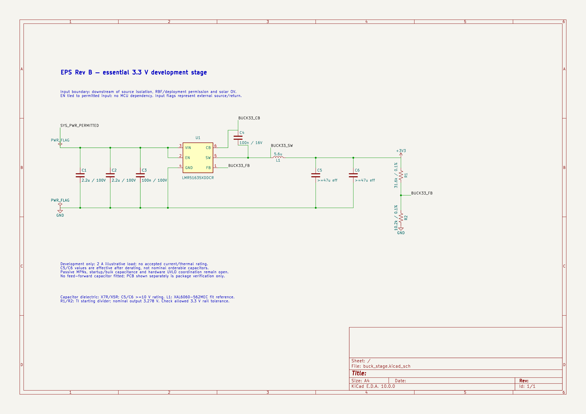

# Essential 3.3 V buck development draft

2026-10-04. A disposable stage was created through Konnect with LMR51635XDDCR, input bypassing, bootstrap capacitor, inductor, output-capacitance requirements and feedback divider. Its six exported nets match the intended physical endpoints. **INCOMPLETE circuit/library acceptance:** one ERC error remains, passive MPNs are unselected and no current, thermal, startup or mechanical qualification has run. The fabricated Rev A schematic and board are unchanged.

[Sizing basis](../design/rev_b_power_stage_sizing_and_fit.md) · [Readbacks](evidence/2026-10-04_buck_stage_readback.json) · [Endpoint/pad verification](evidence/2026-10-04_buck_stage_verified.json) · [Saved netlist](evidence/2026-10-04_buck_stage.net)

## Physical mapping

Manufacturer: Texas Instruments. Exact candidate: **LMR51635XDDCR**, DDC six-lead SOT-23-THN. Source: [SLUSF64B Rev B](https://www.ti.com/lit/ds/symlink/lmr51635.pdf), January 2025, p. 3 Figure 5-1 / Table 5-1 and PDF pp. 31–33 DDC0006A drawing 4214841/E, August 2024. The pin configuration is explicitly top view. The board land example is interpreted as front/component-side view and corroborated against the top-view numbering. Walk counterclockwise from upper-left pin 1, down the left side then up the right.

Active symbol: `Ember_EPS_Power:LMR51635XDDCR_DRAFT_v2`. Footprint: `Ember_EPS_Power:TI_DDC0006A_SOT23_6_DRAFT`.

| Physical lead | Function | Symbol pin / type | Pad | Local X / Y mm | View and evidence |
|---|---|---|---|---|---|
| 1 | FB | 1 / input | 1 | −1.35 / −0.95 | Front/top; upper-left key; p. 3 and DDC land example |
| 2 | EN | 2 / input | 2 | −1.35 / 0 | Front/top; down left; same figures |
| 3 | VIN | 3 / power_in | 3 | −1.35 / +0.95 | Front/top; lower-left; same figures |
| 4 | GND | 4 / power_in | 4 | +1.35 / +0.95 | Front/top; lower-right; same figures |
| 5 | SW | 5 / power_out | 5 | +1.35 / 0 | Front/top; up right; same figures |
| 6 | CB | 6 / passive | 6 | +1.35 / −0.95 | Front/top; upper-right; same figures |

Counts: six physical leads, six symbol pins and six unique electrical pads; no exposed pad, duplicates or mechanical holes. All pads are front Cu/Mask/Paste, 1.1 × 0.6 mm rounded rectangles with 0.05 mm corner radius, 0.95 mm pitch and 2.7 mm row-center separation. IPC-2581 coordinates were normalized by reversing its Y sign. [IPC-2581](evidence/2026-10-04_buck_package.xml) and [GenCAD](evidence/2026-10-04_buck_package.cad) corroborate the saved disposable instance. Symbol and footprint were queried back; renders of the actual sheet and board were inspected for numbering, key, geometry and orientation. The footprint's 4.3 × 3.9 mm courtyard contains the nominal body, pads and silk marker. Mask/stencil process settings and package height tolerance remain assembly checks.

Konnect's file-mode `get_component_pads` returned U1 not found despite the placement being present in both independent exports. That query is unavailable evidence, not a pass. The exports provide the pad readback used above. Symbol default Footprint and Description properties remain unset because the available authoring interface does not set them; the placed instance has explicit fields. Physical identity is checked, but the library is not accepted for production. Version 1 is a superseded presentation trial; use v2.

## Circuit definition

`SYS_PWR_PERMITTED` denotes the PowerPath output **after** battery/solar source isolation, hardware RBF/deployment permission and solar OV protection. Those upstream circuits are not implemented in this isolated stage. EN and VIN connect directly to that input. This allows essential power to start without MCU action; final hardware UVLO/protection coordination remains required. Removing upstream power must also address stored energy and external backfeed during integration. No MCU-controlled essential-power enable is added.

| Net | Exact non-power-symbol endpoints |
|---|---|
| `/SYS_PWR_PERMITTED` | U1.2, U1.3, C1.1, C2.1, C3.1 |
| `GND` | U1.4, C1.2, C2.2, C3.2, C5.2, C6.2, R2.2 |
| `/BUCK33_SW` | U1.5, C4.2, L1.1 |
| `/BUCK33_CB` | U1.6, C4.1 |
| `/BUCK33_FB` | U1.1, R1.2, R2.1 |
| `+3V3` | L1.2, C5.1, C6.1, R1.1 |

Input flags model an externally supplied input and return, not actual power sources. C1/C2 are provisional 2.2 µF / 100 V bypass values; C3 is 100 nF / 100 V. C4 is 100 nF / 16 V between CB and SW. L1 is 5.6 µH, with XAL6060-562MEC as a fit reference. C5/C6 each require at least 47 µF **effective** capacitance and at least 10 V rating. These are design requirements, not two accepted 47 µF nominal parts. Input capacitance at bias, upstream impedance, ripple current, turn-on inrush and any bulk capacitor remain to be selected.

TI's starting divider uses 31.6 kΩ / 10.2 kΩ. With 0.1% resistors and the reference range, the calculated static output spans **3.241–3.316 V**, nominal 3.278 V. This excludes load transients, ripple and resistor temperature effects. Check the consuming boards' permitted rail range before freezing the divider. Feed-forward capacitance is left open; internal compensation does not remove the need to validate the actual LC network and load response.

The PCB in this study contains only U1 for package verification; it is not synchronized with the full stage and is not a stage placement or thermal layout.

## Verification and remaining gates

Exact endpoint checks passed on all six named nets. Konnect reports zero floating wire ends, zero unconnected component pins, zero merged named nets and zero orphan items. Direct KiCad ERC reports **one error, zero warnings**: `+3V3`'s power-input marker is not driven by a power-output pin on its own net, because passive L1 separates it from U1.SW. No output flag was added merely to suppress the finding. This is a classified ERC modeling limitation, not evidence of successful regulation.

All symbols have explicit references; annotation completed. File-backed Konnect mutations persisted and fresh CLI exports verified the saved files. `save_project` could not run because it requires live KiCad IPC, which is not configured in this server session. Consequently the complete workflow remains INCOMPLETE; no live save is claimed. No user action is needed for continued file-backed schematic work.

Next gates are exact passive MPNs/footprints and derating, validated UVLO and low-pack startup, input-source/inrush behavior, real IHU/CAN current steps, COMMS noise, fault/current/thermal limits, routing and mechanical clearance. The new native study remains outside the PR, with candidate libraries and exported evidence/previews included for review.

Scratch source: `/Users/nick/Documents/ChatGPT/EMBER/eps-rev-b-study/buck-stage-2026-10-04/buck_stage.kicad_sch`.

## 5 V bias follow-up

The [LM5177 datasheet](https://www.ti.com/lit/ds/symlink/lm5177.pdf), SNVSBU4F Rev F, pp. 8, 11 and 21–22, specifies supply selection around a 6.35–6.7 V switch-over threshold. With high solar VIN and only 5 V on BIAS, the controller selects VIN. Therefore output-fed BIAS does **not** eliminate high-input linear-bias dissipation in this design. When both supplies are below the switch-over threshold it selects the higher supply, but startup with output at zero still depends on the input.

The regulator's published dropout cases do not provide a full guaranteed gate-drive envelope at 4.5 V input across the intended driver load. Bootstrap UVLO permitting switching is also not proof that an external FET meets its specified on-resistance. CSD18543Q3A remains a physical reference whose 4.5 V resistance specification cannot simply be applied below 4.5 V. The reviewed [PMN55ENEA](https://assets.nexperia.com/documents/data-sheet/PMN55ENEA.pdf) similarly specifies resistance at 4.5/10 V; typical 2.5–3 V curves do not close this gate, so it is not a replacement selection.

Compare a power FET with a guaranteed resistance rating at the derived minimum gate drive against an independently starting auxiliary-bias circuit with enough LDO/bootstrap headroom. The latter adds circuitry, losses and area and must remain inside the hardware-isolation boundary. Do not rely on the 5 V output to bootstrap its own first startup. No 5 V FET or auxiliary supply is frozen at this checkpoint.
