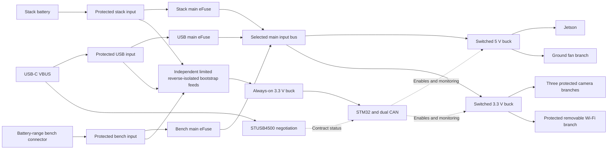

# Payload compute power input and sequencing architecture

> Next-revision decisions are consolidated in [schematic_start.md](schematic_start.md)
> and [source_hardware.md](source_hardware.md). Earlier candidate circuits below
> remain study history where the consolidated baseline supersedes them.

Updated 2026-10-04. This circuit proposal develops the accepted operating
requirements and [preliminary power budget](power_budget.md) into power blocks,
candidate parts, and control behavior. It is not an implemented schematic,
an accepted physical pin map, or a fabrication release.

Follow-up [source-selection study](source_selection.md) corrects the bootstrap
deadlock: AON now has a separate limited, reverse-isolated feed ahead of the
default-off main-path switches. It also revises USB main UV/OV screening and
defines source locking/feedback; the input circuits remain unimplemented.

Use USB-C PD at 15 V / 3 A for the full student-lab setup and a separate
nominal 6.0–8.4 V battery/bench supply path. Keep the supervisor available
with Jetson off. Regulate the Jetson supply to 5 V and provide the peripheral
3.3 V locally so standalone operation does not need stack rails.

## Power blocks

The three input branches join through independently protected reverse-blocking
paths. Grounds share the carrier ground reference. Source selection is not
a jumper that shorts USB and battery voltages together. USB is sink-only;
the payload does not charge the spacecraft battery or power a laptop.

## Candidate parts and sourcing evidence

The Konnect local parts database returned these MPNs and LCSC identifiers
on 2026-10-04. Its update date was not exposed by the stats response, so local
stock/price values are not live ordering evidence. Public JLCPCB listings
were additionally found for STUSB4500QTR and TPS56637RPAR. Recheck stock,
assembly service, package, cost, and exact suffix before freezing the BOM.
All listed local database entries are Extended-library parts.

| Function | Preferred candidate to evaluate | Manufacturer capability relevant here | Local database ID |
| --- | --- | --- | --- |
| USB-C PD sink | STUSB4500QTR | Autonomous negotiation; NVM-configured sink profiles [1] | C2678061 |
| Each protected input | TPS259470LRPWR | 2.7–23 V, 5.5 A family; true reverse blocking, adjustable UV/OV, active current limit, latched fault response [2] | C3662793 |
| Main 5 V buck | LMR51460SQDRRRQ1 | 4–36 V input, 6 A class, PFM, adjustable frequency; application example covers 6 V input / 5 V output [10] | C41802645 |
| Switched 3.3 V buck | TPS62933PDRLR | 3.8–30 V input, 3 A class, power-good and light-load PFM [4] | C5219254 |
| Always-on 3.3 V buck | LMR36506RRPER, adjustable version | 3–65 V family, 0.6 A, power-good; confirm exact variant's operating limits and reference [5] | C2870127 |
| Fixed-output always-on alternative | LMR36506R3RPER | Same family, fixed 3.3 V; evaluate cost/availability against adjustable version [5] | C3190188 |

The switched 3.3 V regulator's 3 A capability gives margin above the budget's
2 A minimum target. This is not an accepted 3 A connector or branch limit.
TPS62933P has PG where the legacy TPS62933F uses SS; do not substitute it
without correcting pin functions and soft-start expectations.

TPS62177 was screened but is not preferred for this bootstrap path: its
4.75 V minimum input leaves little margin at USB's initial nominal 5 V after
source tolerance and path drops [6]. The wider-input LMR36506 avoids relying
on that narrow margin. Confirm startup under the applicable USB VBUS limits.

## USB-C negotiation and startup

Proposed sink profiles, in increasing priority order:

| Profile | Request | Allowed load behavior |
| --- | --- | --- |
| PDO1 | 5 V, conservative bootstrap current | PD controller, STM32, indication; Jetson and peripherals off |
| PDO2 | 9 V / 3 A | Optional qualified low-power lab profile; initially leave full payload disabled |
| PDO3 | 15 V / 3 A | Full lab profile, subject to valid contract and input checks |

Select and verify bootstrap current against USB attach rules and the measured
always-on startup load. The preliminary 0.350 W supervisor allocation is about
88 mA input at 5 V and 80% conversion efficiency, before PD/indicator overhead.
Target a total bootstrap draw at or below 100 mA only if measurement confirms
it; otherwise revise the USB attach/current handling and NVM request.

1. STUSB4500 is powered from the receptacle-side VBUS, independently of the
   STM32. It must be able to negotiate from an otherwise unpowered board.
2. The separate USB bootstrap branch admits initial power for supervision.
   Keep USB main admission and both switched regulators off by hardware default.
   The proposed USB main eFuse now admits only the high-voltage profile.
3. STM32 reads source capabilities, actual explicit contract/current, and
   input voltage. A voltage measurement alone is not proof of available power.
4. Only the full accepted profile may permit normal automatic bench startup.
   The 9 V profile stays supervisory-only until a lower-power image/startup
   profile is tested. A low run-mode setting alone does not prove low startup
   demand.
5. Program and read back the controller's NVM during assembly/bring-up. Include
   5/9/15 V profiles only; no 20 V request is required. Use the intended sink
   current rather than requesting all current the source advertises.
6. Evaluate STUSB4500's VBUS_EN_SNK and POWER_OK outputs with their specified
   polarity and NVM configuration. POWER_OK can remain asserted after detach;
   qualify permission with attachment/VBUS_EN_SNK and a hardware voltage check.
   Do not treat POWER_OK alone as a live source-valid signal [1].

POWER_ONLY_ABOVE_5V=0 remains the starting NVM proposal. The separate bootstrap
supply now avoids depending on the selected main path. Any use of the other
setting must explicitly reconcile attach/indication and bootstrap gating.

## Input isolation and source selection

Each source needs current limiting, controlled inrush, UV/OV supervision,
reverse-current blocking, and coordinated surge/ESD protection. TPS259470L is
the candidate with adjustable overvoltage cutoff; the TPS259472 variant's
fixed clamp options are not interchangeable with the desired 15 V input.

| Mode | Permitted sources | Behavior |
| --- | --- | --- |
| Bench jumper fitted at startup | USB or battery-range bench connector | Automatic startup only with a qualified source; stack battery path held off |
| Stack mode | Stack battery | USB/bench branches held off; STM32 waits for IHU authorization |

Implement source permission in hardware, including a high-impedance/resetting
MCU state. Sample the mode jumper at startup; changing it while powered does
not initiate a live mode transition. The lab kit ships with bench mode selected.
Source choice is separately locked for the AON power cycle, per the source
study; ordinary MCU reset cannot silently retarget it. Main-path selection
does not disable the small independent bootstrap feeds.

Within bench mode, require one main source at a time for normal operation.
Reverse-blocking paths protect against accidental multiple inputs; report
that condition and avoid authorizing startup until one source is selected.
An ORed pair tends to favor the higher voltage, but that is not controlled
priority, deterministic load sharing, or a qualified seamless transfer.

Do not promise hot swapping. If a source detaches or a contract changes during
operation, inhibit triggers, remove run permission, and use remaining energy
for orderly shutdown only when it is sufficient. Default switched rails off
after a supervisor reset. Sudden input removal has no guaranteed file-write
hold-up. Input-protection latch-off may require source removal/reapplication;
it is separate from STM32's bounded Jetson recovery.

In a flight build, omit or physically isolate alternate bench-feed paths as
needed by the spacecraft inhibit architecture. The bench jumper and STM32
logic are not substitutes for the unresolved raw-VBAT hardware isolation [7].

## Current, voltage, and passive sizing constraints

- Full USB profile: branch current-limit tolerance and total load must remain
  within the negotiated 3 A. At 15 V the 15 W lab estimate is 1.64 A at 90%
  efficiency. Do not choose a nominal 3 A limit whose upper tolerance exceeds
  the contract without another effective current-control mechanism.
- Battery/bench: the 15 W lab case is 4.09 A at 6 V before additional voltage
  sag. At 85% efficiency with 20% load allowance it reaches about 5.19 A.
  The 5.5 A eFuse class is therefore conditional, especially after tolerance,
  connector/harness limits, temperature, and inrush. Reduce permitted load or
  choose a higher-current protection design if the actual envelope requires it.
- Do not permit the 25 W compute case from the battery path by default. At
  6 V its un-margined estimate already approaches 6 A. Main regulator capacity
  does not establish input-path capacity.
- Main buck must regulate 5 V at the lowest loaded input voltage. TPS56637's
  minimum off-time and conduction losses make low-battery headroom a specific
  verification item; its 4.5 V minimum input rating does not promise 5 V output
  at that input. LMR51460 is now preferred for evaluation, with a 6 V-input
  application example and fewer apparent conflicts with the existing bulk
  capacitors. Neither example proves performance after harness/protection
  drops. See the [component sizing study](power_component_sizing.md) [3,10].
- Set battery UV/restart thresholds using voltage at the converter and EPS
  limits. Set USB UV/OV windows around the accepted profile. Exact resistor
  values and tolerance windows are proposed in the component sizing study;
  they are not final EPS battery cutoffs or a substitute for main-rail checks.
- Select input capacitors for 15 V plus negotiated tolerance and the actual
  transient envelope. 25/35 V capacitor classes are candidates, not proof of
  surge tolerance. Protect the 23 V-limited eFuse input appropriately; a TVS
  whose rated standoff sounds suitable can still clamp above that limit.
- Size inductors using peak ripple current, saturation over temperature, DCR,
  and actual regulator current-limit behavior, rather than a 6 A label alone.
  Select output capacitance within the manufacturer's stability range and
  verify effective capacitance after DC bias.
- Regulator PG thresholds can be wider than Jetson's valid 5 V supply range.
  Add an appropriate voltage-window supervisor if needed; PG alone must not
  be assumed to guarantee 4.75–5.25 V at the module connector.

## Sequencing and control ownership

STM32's always-on supply powers CAN, diagnostics, and a protected connection
to Jetson. Every control crossing to an unpowered Jetson requires appropriate
translation/isolation; locally derive needed reference rails. Do not use the
legacy named +1V8_MOD rail as evidence of an exported module supply.

1. Keep main/peripheral enables and POWER_EN inactive through supervisor reset.
   Keep camera triggers inactive and their outputs high impedance as needed.
2. Verify mode, source, faults, and IHU permission or bench authorization.
3. Enable the main 5 V converter. Verify stable voltage at the Jetson input
   using qualified monitoring, then assert module POWER_EN through the proper
   interface.
4. Use module SYS_RESET_N release to qualify peripheral power and signal
   enables per the exact module design guide. Stage cameras and M.2 to manage
   inrush; do not drive module I/O before the permitted point [8].
5. Start with a valid fan PWM/control state and tach monitoring. Fan power can
   share the switched 5 V converter through its own protected branch, but fan
   control must not back-power the module. Define fail-safe cooling if Linux
   hangs separately from connector compatibility.
6. Wait for application readiness and all camera-arm confirmations before
   permitting scheduled triggers. Linux ready is distinct from electrical PG.
7. On normal stop, halt triggers, request Jetson shutdown, finish storage writes,
   and obey the module's shutdown handshake and rail-discharge timing.
8. Provide a hardware-qualified SHUTDOWN_REQ_N-to-POWER_EN shutdown path meeting
   the module requirements even when STM32 software is stuck. The STM32 can
   observe/report it but must not be the only time-critical response [8].
9. Forced recovery disables the payload domain, verifies discharge and a
   minimum off interval, then attempts a bounded restart. Recovery timeouts,
   retry counts, and persistent fault behavior remain firmware parameters.

IHU retains authority to grant/revoke payload operation in stack mode.
Accepted 2026-10-04: normal shutdown begins over CAN, with permission retained
until shutdown completes. PAYLOAD_EN low is an immediate hardware kill and
can interrupt storage writes. The [power-control contract](power_control.md)
defines separate converter/module enables and an asynchronously cleared run
latch so shutdown or voltage recovery cannot cause unintended restart.
Converted carrier and canonical stack pin-map wiring still need reconciliation
with this contract during implementation.

## Monitoring and debug provisions

Allocate supervisor inputs for selected-source voltage, main 5 V voltage,
switched 3.3 V voltage, input current, regulator/input faults, temperature,
module reset/shutdown status, fan tach, mode jumper, and PD status/I2C.
Use a current monitor or Kelvin shunt circuit with known accuracy so IHU can
receive session-energy measurements. Its exact IC and shunt are unselected.

Provide test access to raw USB VBUS, protected input bus, the three local
rails, ground beside each rail, regulator enables/PG, POWER_EN,
SYS_RESET_N, SHUTDOWN_REQ_N, fan PWM/tach, and camera trigger/strobes.
Keep STM32 SWD, the supervisor–Jetson UART, and Jetson debug console distinct.
Provision USB recovery separately from the USB-C power function unless a
deliberate combined-port design is later accepted.

## Implementation boundary and next work

Konnect tool availability was confirmed. The carrier schematic and PCB are
unchanged; project-local libraries/tables and a disposable power circuit have
now been created through Konnect.
The [component sizing study](power_component_sizing.md) and reproducible
[calculator](power_sizing.py) now cover preliminary passives and threshold
corners. The main regulator's physical library acceptance now passes after
correcting the stock footprint mismatch and repairing Konnect's query/default-
footprint capabilities. The live scratch footprint also matches the library.
See the [library acceptance record](lmr51460_library_acceptance.md).
Before real schematic placement, accept exact manufacturer pin-to-symbol-to-
footprint maps for the chosen suffixes and connectors using the library
workflow. Resolve current-limit/UV/OV thresholds, source-mode hardware,
USB bootstrap/contract gating, regulator passives, and sequencing timing.
Then implement complete power blocks through Konnect and verify connectivity,
ERC, saved exports, and rendered schematic evidence.

## Sources

1. [STUSB4500 datasheet](https://www.st.com/resource/en/datasheet/stusb4500.pdf), sections 2.2.8–2.2.10, 3.3, 5, and 6.
2. [TPS25947 datasheet](https://www.ti.com/lit/ds/symlink/tps25947.pdf), variant comparison and reverse-current/protection behavior.
3. [TPS56637 datasheet](https://www.ti.com/lit/ds/symlink/tps56637.pdf), operating conditions, timing, PG, and application design.
4. [TPS62933P product specification](https://www.ti.com/product/TPS62933P).
5. [LMR36506 product specification](https://www.ti.com/product/LMR36506).
6. [TPS62177 product specification](https://www.ti.com/product/TPS62177).
7. [Stack pin map](../../../system/interfaces/cskb_pinmap.md) and [inhibit architecture](../../../docs/architecture/inhibit_and_deployment.md).
8. [Local Orin Nano datasheet](Jetson_Orin_Nano_Series_DS-11105-001_v11.pdf), printed pages 25–27 and 34; exact module design guide governs implementation.
9. Public JLCPCB listings: [STUSB4500QTR C2678061](https://jlcpcb.com/partdetail/STUSB4500QTR/C2678061), [TPS56637RPAR C841386](https://jlcpcb.com/partdetail/TexasInstruments-TPS56637RPAR/C841386).
10. [LMR51460-Q1 datasheet](https://www.ti.com/lit/ds/symlink/lmr51460-q1.pdf), SLUSFR3, August 2024; sections 6.3, 6.5, 8.2 and package drawings.
