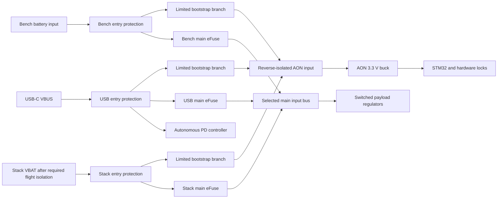

# Source selection and bootstrap supply

2026-10-04. Architecture and numerical/logic screening completed. Standalone [AON](aon_regulator.md) and [USB admission](admission_control.md)
prototype circuits are now wired and checked. The complete input system is
not wired, the BOM is unqualified, and this is not a fabrication release. Continues [permission control](permission_control.md) and supersedes
the single selected-bus AON supply in [power architecture](power_architecture.md).

## Separate supervision from payload power

The old arrangement depended on a selected source to power the MCU that
selects it. Main paths must default off, so that creates a startup deadlock.
Provide a separate small bootstrap supply that does not depend on mode/source
locks, IHU permission, main-buck readiness or MCU code.

Entry protection includes a coordinated fuse/current protection and transient
network; exact parts are unselected. It must cover both bootstrap and main
branches. A main eFuse does not protect an AON branch tapped ahead of it.
The autonomous STUSB4500 remains receptacle-powered so an unpowered carrier
can negotiate. Grounds are common, with no intended charging of another input.

A low-current diode-OR into one wide-input AON buck is the preferred topology
to evaluate for the prototype. It avoids three separate AON regulators and
keeps high-current main paths independently controlled. It is not yet an
accepted reverse-isolation implementation: quantify diode leakage into absent
sources, reverse voltage, temperature, inrush, USB detach/discharge interaction,
faulted regulator backflow and bootstrap short protection. A higher-voltage
source may supply AON regardless of main mode; that does not authorize its
main branch. The AON OR can change its supplying source, but it promises no
reset-free transfer or storage hold-up.

PMEG6010CEJ is only a bootstrap diode candidate. Its published 100 mA/25°C
pulsed forward limit is 0.4 V; the reverse-current temperature plots are
typical, so they do not establish flight-temperature leakage bounds.
At an assumed 4.75 V USB input and that 0.4 V drop, 0.350 W of AON loads at
80% conversion needs 100.6 mA before controller/indicator overhead.
The previous active-supervisor allocation cannot prove a 100 mA bootstrap
budget. A provisional reduced startup allocation of 0.250 W gives 71.8 mA
under those same assumptions. Hold CAN transceivers in a defined low-power
state, keep the payload off and minimize indicators during bootstrap.
Measure total attach/startup draw and obey the source's actual current
advertisement; these calculations are not USB compliance evidence.

LMR36506R3RPER, fixed 3.3 V auto/PFM mode, is the preferred AON candidate
for reduced standby draw. Its system table allows −1.5%/+2.5% under stated
conditions. The new DC allocation is 3.2505–3.3825 V, replacing ±2%:
[budget calculation](aon_supply_budget.py). The G33 supervisor retains 57.7 mV
static release margin; LVC logic stays inside its 3.0–3.6 V supply range.
Bench Schmitt thresholds across the complete supply interval remain unqualified.
Reference input supply remains within its previously selected operating range;
the precision comparator remains powered by the main 5 V rail. Exact STM32,
CAN and translator rail/interface budgets still need part-specific checks.
The [AON physical map](aon_library_acceptance.md) and documented prototype
corner lands are accepted. Its 1 MHz fixed-output circuit uses RT tied to VCC,
15 µH and two 22 µF capacitors; exact passives and assembly qualification remain open.
Verify cold-start/dropout, ripple, routing drops and transients separately.

## Main-source choice

Use a startup-only hardware source lock, following the transparent-sampler
then lock pattern already studied for bench mode. Three independently latched
request bits encode USB, bench connector and stack. Default all low; only a
one-hot encoding can enable a main path. Reject every multi-request encoding
globally. Ordinary MCU reset and changes to request pins cannot change a
locked choice. The defined way to choose another source is an AON power cycle;
the lab instructions can simply say to disconnect power before changing feeds.
No additional source-selection jumper is required for the one-cable kit.

The source-lock implementation is still to be wired and timing-qualified.
The Python model below specifies its behavior; it is not proof of a hardware
lock. Mode and source locks are separate from the fresh-arm run latch.

| State | Main path behavior |
|---|---|
| AON starting, mode/source not locked | All main paths off |
| Bench mode, only USB lab input present | USB eligible after full contract/voltage qualification |
| Bench mode, only bench connector present | Bench eligible within its qualified voltage/load profile |
| Bench mode, USB and bench both present | No main startup; indicate conflicting lab supplies |
| Bench mode, stack also connected | Stack main path remains off; a small AON feed may still exist |
| Stack mode | Only stack main path eligible; wait for IHU before starting payload regulators |
| Selected source fails/detaches | Permission lost; do not transfer to another main input |
| Source recovers | Existing run latch still requires deliberate qualification and a fresh arm edge |
| Ordinary MCU reset | Main admission off through MCU-alive qualification; locks remain unchanged |

In boolean terms, shared admission requires AON reset released, MODE_LOCKED,
SOURCE_LOCKED, MCU_ALIVE and exactly one latched request. Each decoded branch
also requires the correct mode, its own raw presence/voltage validity, and USB
contract validity where applicable. Bench further requires exactly one lab
input present. Presence is measured on each raw input; shared-bus voltage
must not make an absent input appear present.

Do not gate source admission with SOURCE_OK or with the bus voltage that
admission creates. Admission first charges the main bus; qualification then
permits the downstream bucks. Main 5 V qualification subsequently permits
module arm, rather than gating the buck's own startup.

## eFuse and feedback contracts

Retain TPS259470LRPWR as an input-protection candidate, with separate default-off
enable circuitry and adjustable UV/OV. Its ten-lead symbol/footprint map has
now been checked in a disposable project: [package acceptance](efuse_library_acceptance.md).
The [USB input prototype](admission_control.md) now uses this package in a
checked standalone circuit. Physical default-off qualification remains open.
Its reverse blocking is appropriate upstream of converters; this is not a
proposal to put it between the 5 V buck and the Jetson, where NVIDIA's module
reverse-current requirement applies.

Neither AUXOFF nor released FLT alone proves a healthy selected source:
AUXOFF can remain high during load faults; UV/OV may leave FLT released.
Combine branch admission/enable feedback, independently valid raw voltage,
selected-bus voltage, completed inrush, fault status and operating profile.
Unpowered status outputs need a qualified interface rather than an assumed
AON pull-up. A voltage reading alone cannot identify which parallel path
actually conducts or detect every failed-short switch.

Distinguish latched requests, hardware enable commands and qualified source
feedback. The permission study's LAB_SOURCE_SELECTED/STACK_SOURCE_SELECTED
inputs must be reconciled with that feedback, not connected directly to
unverified MCU commands. USB and bench remain separate physical paths even
though permission control groups them as LAB.

The default-off enable interface must hold EN/UVLO below its shutdown threshold
when AON is absent/resetting, while preserving the raw-input UV divider when
enabled. A plain divider plus MCU pulldown does not prove this behavior.
The standalone raw-powered MOSFET clamp now implements this intent, but its
nonzero-gate leakage, temperature, slow/fast ramps, negative input and
fault-reset behavior remain unqualified. Resolve those before carrier integration.
Only pulling below UVLO is insufficient to clear every latched eFuse fault.

## Revised USB main-path thresholds

Because USB bootstrap is separate, the main eFuse need not admit 5 V.
The earlier 56.2 kΩ USB EN divider also missed TI's ≥350 kΩ pull-up
recommendation for inputs above 5 V or reverse-polarity exposure.
The USB clamp prototype uses 0.1% resistors, tabulated thresholds, a conditional
±1.1 µA combined EN/clamp leakage allocation and ±0.1 µA OV leakage. It replaces
the earlier 1 MΩ / 100 kΩ eFuse-only screen:

| USB main threshold | Top / bottom | Rising range | Falling range |
|---|---|---|---|
| UV | 374 kΩ / 37.4 kΩ | 12.578–13.889 V | 11.404–12.710 V |
| OV | 365 kΩ / 29.4 kΩ | 15.804–16.473 V | 14.371–15.035 V |

The rising UV ceiling is below an assumed 14.25 V minimum full-profile input;
the rising OV floor exceeds an assumed 15.75 V maximum. Those assumed ±5%
source limits still require agreement with the bank/cable/PD qualification.
These coarse protective thresholds do not establish a precise 15 V operating
window, contract current, TVS clamp adequacy or enabled-interface leakage.
An OV event can require input removal or deliberate recovery despite restored
nominal voltage because of hysteresis.
Keep the existing battery divider screen for comparison.
Use dVdt capacitors rated for the largest shared output/input plus the
datasheet's 5 V allowance; evaluate 50 V parts for all three branches.

## USB full-power proof

Propose STUSB4500 NVM: three PDOs (5 V conservative bootstrap, 9 V supervisory
fallback, 15 V / 3 A full lab), POWER_OK_CFG=10b, REQ_SRC_CURRENT=0.
Read back every configured value in production/bring-up.
In that configuration POWER_OK3 is active low for the PDO3 contract; qualify
it with attachment/VBUS_EN_SNK and actual raw/bus voltage. It can retain its
state after detach. Require the explicit contract/current readback before
the MCU grants load permission; software must never treat voltage alone as
proof of available current. The controller's match algorithm compares both
requested voltage and current to source capabilities.
POWER_ONLY_ABOVE_5V=0 remains the starting configuration; independent bootstrap
removes the old supply deadlock, but changing that option still needs an
explicitly reviewed connection and indication path.
Exact signal translation, NVM image, 5 V attach budget and reset/detach timing
are not implemented here.

## Current limit and remaining work

The tabulated 750 Ω battery limit screen gives 3.956–4.845 A including 0.1%
resistor scaling. At 6 V/85% conversion with 20% load allowance, the provisional
15 W flight case needs 4.253 A and the full lab case 5.194 A. The original
setting does not cover both; regulator class is not input-current capacity.
Keep full lab operation on 15 V PD. Evaluate a revised battery limit/protection
and loaded-voltage headroom, or qualify a reduced load profile before release.
No software power setting alone guarantees acceptable boot/transient current.
The USB prototype now uses a tabulated 1.65 kΩ / 0.1% current-limit point,
screened at 1.798–2.202 A. This supersedes the 1.30 kΩ estimate for that circuit.
Its load/boot behavior and total USB draw including bootstrap/controller loads
need checking against the actual contract.

Next implementation order: exact bootstrap protection/diodes and AON passives;
qualify the USB enable clamp and implement source-lock/decoder hardware;
complete branch passives and raw/bus/contract/fault feedback; then integrate with the
existing mode and run-latch studies. Board copper, connectors, source
impedance, thermal design, inrush and fault energy must be included.
For flight, both AON and main stack branches must be downstream of the required
physical launch isolation. The documented raw-VBAT inhibit gap remains open.
Omit/isolate lab bootstrap and main paths in the flight assembly as required.

Run `python3 design/source_selection_study.py`: 32,768 admission combinations,
24 immutable-source sequences, 64 health combinations and DC/current screens.
It checks intended behavior, not a saved schematic or physical switch timing.

## Primary sources

- [TI TPS25947](https://www.ti.com/lit/ds/symlink/tps25947.pdf), SLVSFC9C May 2026, pp8–9, 38–39 and section 6.3 footnotes.
- [ST STUSB4500](https://www.st.com/resource/en/datasheet/stusb4500.pdf), DS12499 Rev8, sections 2.2.8, 2.2.10, 3.3.2 and NVM tables.
- [TI LMR36506](https://www.ti.com/lit/ds/symlink/lmr36506.pdf), SNVSBB6C, output accuracy/mode tables.
- [Nexperia PMEG6010CEJ](https://assets.nexperia.com/documents/data-sheet/PMEG6010CEJ.pdf), January 2023, p3 characteristics.
- [Existing inhibit architecture](../../../docs/architecture/inhibit_and_deployment.md).
