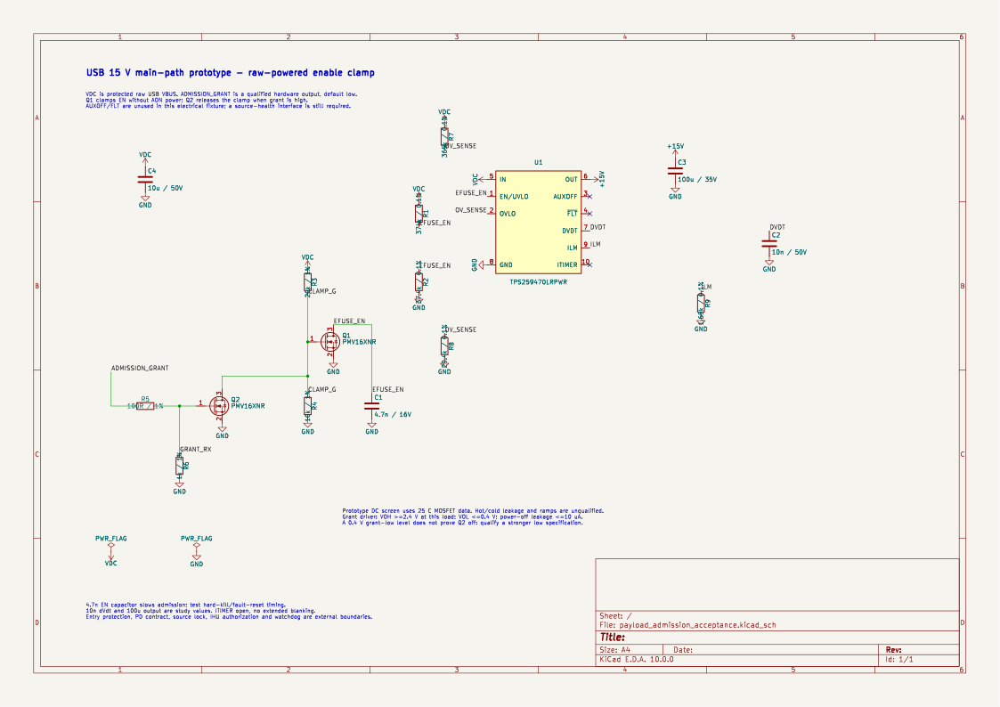
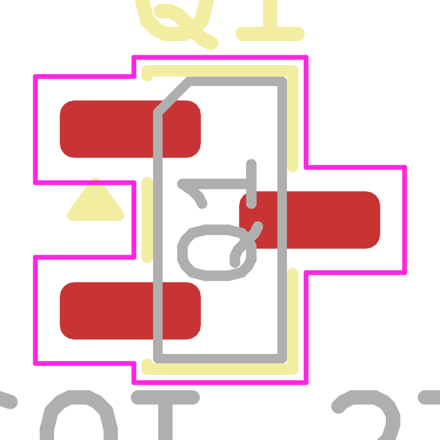

# USB admission prototype

[Circuit decisions and qualification limits](../../admission_control.md).
[Accepted MOSFET physical map](../../admission_library_acceptance.md).

Standalone USB eFuse circuit and raw-powered enable clamp are wired.
13 exported nets; zero ERC errors; one expected ADMISSION_GRANT external-input
warning. Pin, wire, short, orphan and symbol-overlap checks pass. Saved/read
through Konnect's closed-file path. Electrical default-off, temperature and
ramps remain unqualified. The PCB is only an unconnected Q1 package placement.

- [Schematic](payload_admission_acceptance.kicad_sch)
- [Exported netlist](payload_admission_acceptance.net)
- [Check evidence](payload_admission_acceptance-checks.json)
- [Package evidence](payload_admission_acceptance-package-evidence.json)
- [Reproducible topology/package check](../check_admission_study.py)

