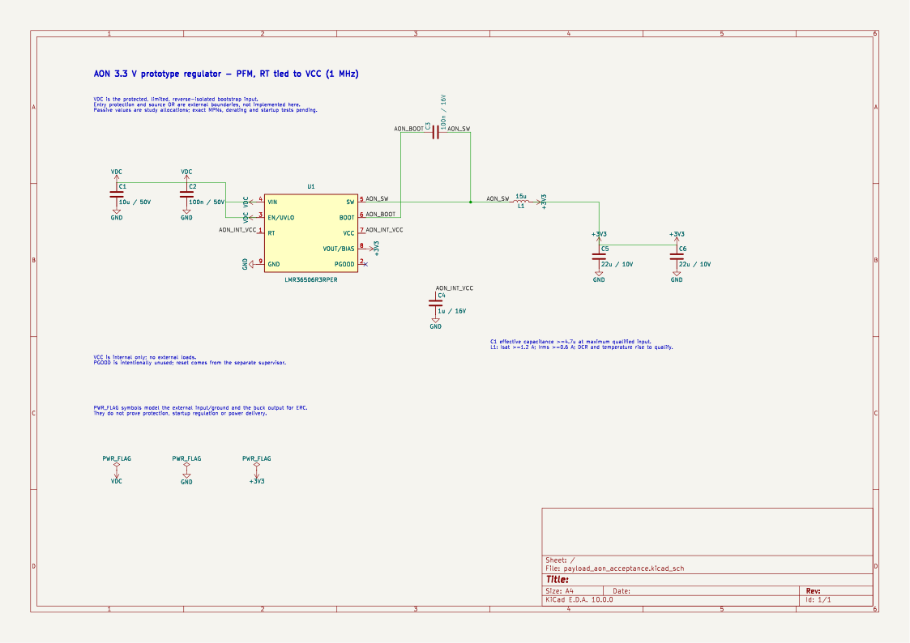
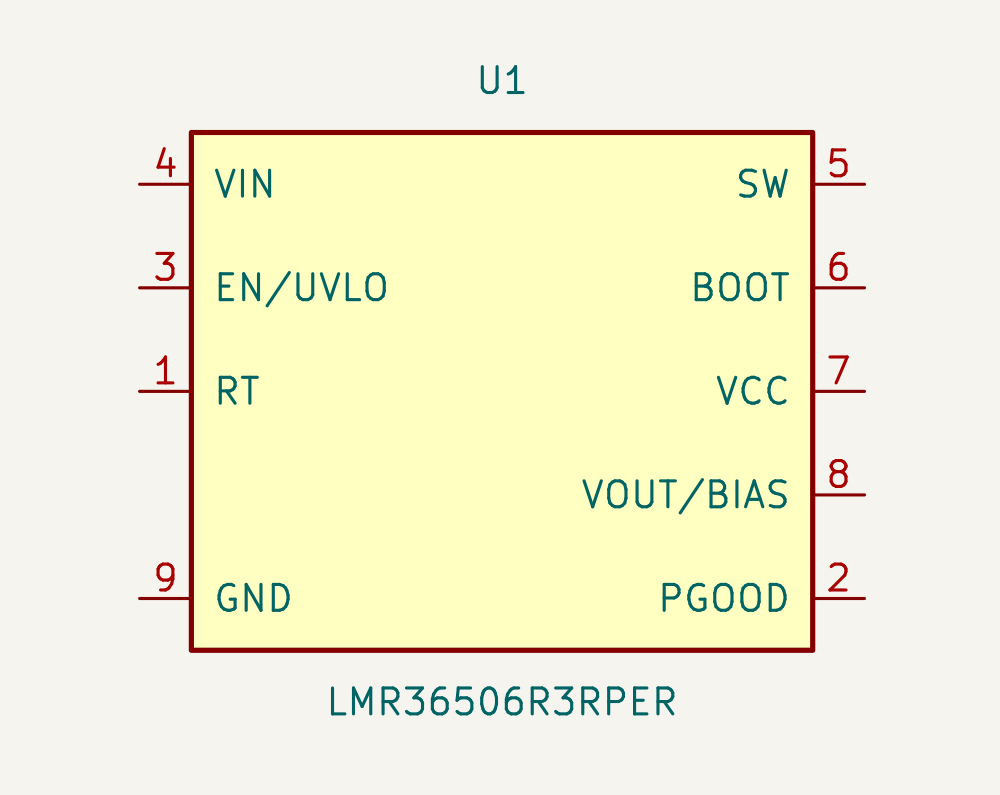
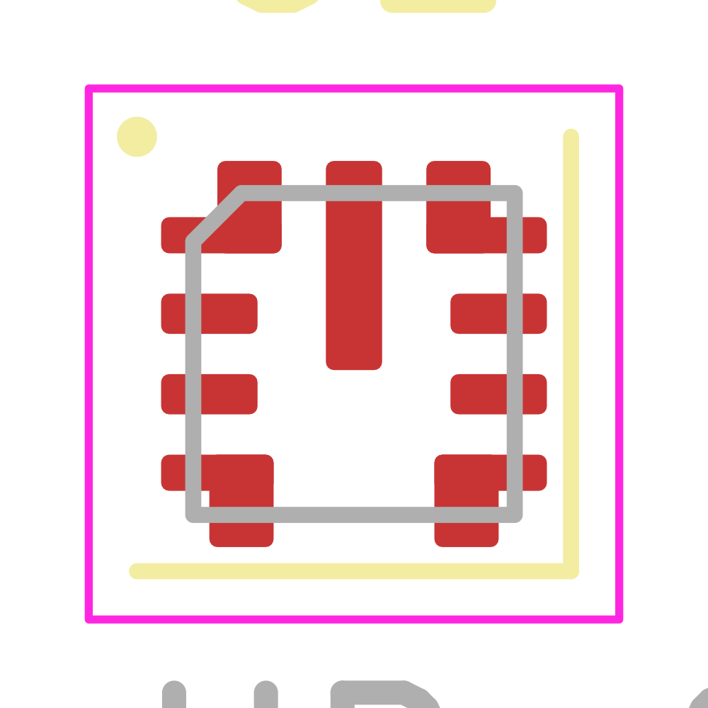

# AON regulator study

[Circuit decisions and qualification limits](../../aon_regulator.md).
[Physical map and prototype land choices](../../aon_library_acceptance.md).

Standalone AON converter is wired: fixed 3.3 V, RT tied to VCC (1 MHz),
15 µH and two 22 µF output capacitors. Exact passives remain allocations.
Seven exported nets; ERC zero errors/warnings; pin, wire, short, orphan
and symbol-overlap checks pass. Closed-file Konnect saves/readback used.
The board is only a disposable unconnected package placement.

- [Exported netlist](payload_aon_acceptance.net)
- [Check evidence](payload_aon_acceptance-checks.json)
- [Reproducible topology/package check](../check_aon_study.py)

- [Schematic](payload_aon_acceptance.kicad_sch)
- [Disposable PCB package](payload_aon_acceptance.kicad_pcb)
- [Package readback](payload_aon_acceptance-package-evidence.json)

Prototype geometry has deliberate widened lower corner arms and square concave
corners. Stencil and assembly qualification are pending.
