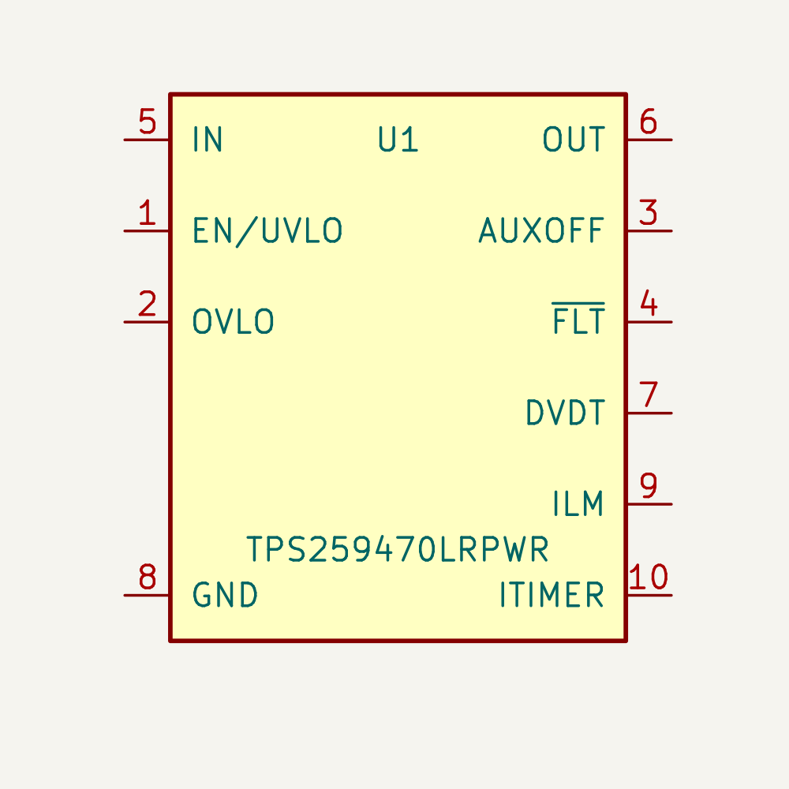
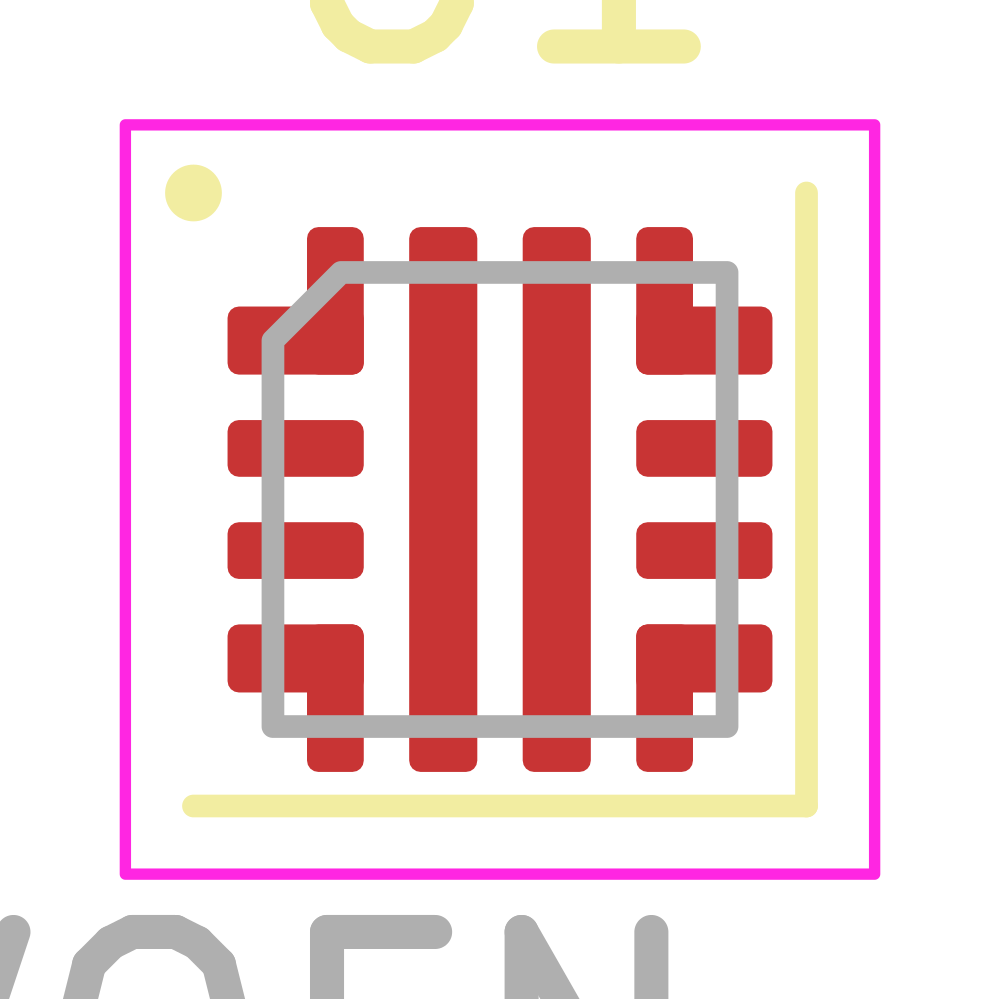

# Input-power package fixture

This disposable KiCad project verifies the TPS259470LRPWR package only.
It does not implement an input power path or enable its output.
Acceptance record: [physical lead map](../../efuse_library_acceptance.md).

- [Schematic](payload_input_acceptance.kicad_sch)
- [Board](payload_input_acceptance.kicad_pcb), one unconnected U1 at 20/20 mm
- [MCP query and placed-instance evidence](payload_input_acceptance-package-evidence.json)
- [Exported netlist](payload_input_acceptance.net)
- [Verification script](../check_input_package.py)

Four intentional duplicate pad numbers form L-shaped copper leads. Unnumbered
paste-only shapes are apertures, not extra electrical leads. The long centre
bars are IN and OUT, never ground. See the acceptance record for the deliberate
local difference in the concave corner contour and the 0.100 mm stencil basis.
