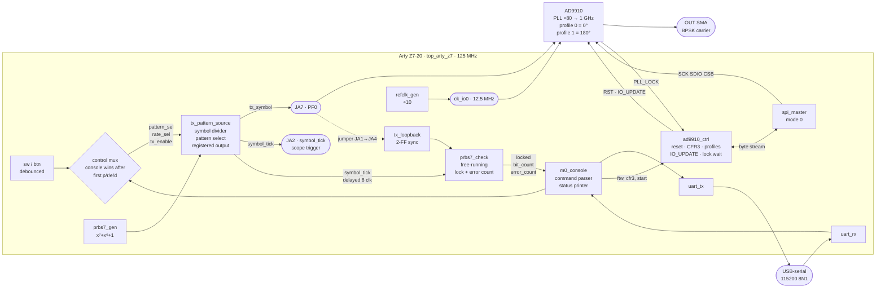
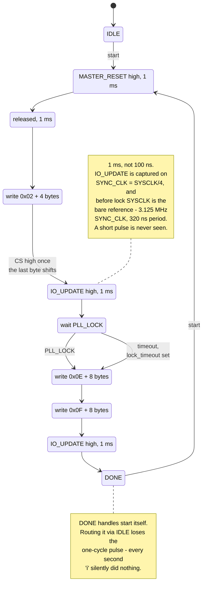

# FPGA — M0 symbol engine

Milestone M0 of the experimental S-band payload: the reusable symbol source
that every later architecture sits on top of. Symbol timing, pattern selection,
PRBS-7, and a registered output.

See [`../README.md`](../README.md) for the payload's scope and milestones and
[`../sband_payload_architecture_trade_study.md`](../sband_payload_architecture_trade_study.md)
for why this block is built before anything else.

---

## Quick start

```bash
cd hardware/payload_exp_sband_tx/fpga
make golden     # Python only - no HDL toolchain needed
make check      # golden + lint + both testbenches
make sim-long   # the M0 gate: 1,000,000 symbols, zero errors
make waves      # FST traces for GTKWave
make gtkwave    # open the traces in GTKWave
make bitstream  # Vivado build on the m75q host, bitstream comes back
make program    # load it over USB-JTAG
make ascii      # render the symbol stream in the terminal - no display needed
make tools      # install notes if something is missing
```

`make ascii` is the fastest way to see the design actually working. It samples
`tx_symbol` on every `symbol_tick` and draws it, then checks the captured bits
against the golden PRBS-7 at all 127 phases:

```text
  tx_symbol  ────────┐ ┌───┐     ┌───┐ ┌─┐   ┌─┐ ┌─────┐ ┌─────┐   ┌───┐
                     └─┘   └─────┘   └─┘ └───┘ └─┘     └─┘     └───┘
             1 1 1 1 0 1 1 0 0 0 1 1 0 1 0 0 1 0 1 1 1 0 1 1 1 0 0 1 1

  ✓ matches the golden PRBS-7 sequence at phase 90
```

`make golden` is worth running first on any machine. It needs nothing but
Python 3 and it checks the part of the design most likely to be wrong.

Every simulation target runs **Verilator `--lint-only` before Icarus compiles**.
Verilator's diagnostics are markedly better, so it should be the first thing to
see a change; Icarus then runs the event-driven testbench. The RTL is held to a
clean `-Wall` with no suppressions except one documented empty debug port.

---

## What is here

| Path | Contents |
|---|---|
| `rtl/prbs7_gen.sv` | PRBS-7 generator, x^7 + x^6 + 1 |
| `rtl/prbs7_check.sv` | Free-running PRBS-7 checker with lock detection and error counting |
| `rtl/tx_pattern_source.sv` | Symbol-tick divider, pattern selector, registered output, buffer enable |
| `rtl/top_arty_z7.sv` | Arty Z7-20 bench top: switches, buttons, LEDs, Pmod, loopback |
| `constraints/arty_z7_20.xdc` | Pins from Digilent's official master XDC |
| `vivado/` | `build.tcl`, `program.tcl`, and the container runner |
| `sim/prbs7_golden.py` | Golden model of the sequence, plus a model of the checker |
| `sim/tb_prbs7.sv` | Sequence properties and checker behaviour |
| `sim/tb_tx_pattern_source.sv` | Symbol timing, patterns, output registration, loopback |
| `sim/ascii_wave.py` | Renders the symbol stream as a waveform in the terminal, no GUI needed |
| `constraints/` | Arty Z7 pin plan and build flow — see its README |

---

## The PRBS-7 convention

Stated once, here, and matched by the RTL, the golden model, and the checker:

```text
polynomial   x^7 + x^6 + 1
state        7 bits, state[6] is the MSB
seed         7'b111_1111 (0x7F)
output       state[6], taken BEFORE the shift
feedback     state[6] XOR state[5]
next state   {state[5:0], feedback}
```

"Output before the shift" is the detail most often got wrong when a generator
and a checker are written separately, or when a hex polynomial value is copied
out of a library that uses a different shift direction. It is not trusted here:
`sim/prbs7_golden.py` writes one period to `sim/vectors/prbs7_expected.txt` and
`tb_prbs7.sv` compares the RTL against that file bit for bit.

The first 127 bits, for eyeballing a scope capture:

```text
1111111000000100000110000101000111100100010110011101010011111010
000111000100100110110101101111011000110100101110111001100101010
```

A useful identity that falls out of the convention, and the one the checker
predicts with:

```text
b[k+7] = b[k] XOR b[k+1]
```

---

## Why the checker is free-running

Once locked, `prbs7_check` predicts each bit from its own history and shifts
the *predicted* bit into its register, not the received one.

A self-synchronising checker — one that shifts the received bit in — is simpler
and needs no lock logic, but a single channel error passes through the register
three times and is counted three times. That makes it useless for measuring a
bit error rate. It also never reports a loss of lock, because it silently
re-synchronises to whatever it is fed.

The cost is that lock has to be managed explicitly:

```text
HUNT    shift 7 received bits in to acquire a phase
VERIFY  free-run; 32 consecutive correct predictions before declaring lock
LOCKED  count checked bits and errors
```

VERIFY exists so a random seven-bit load is not mistaken for a lock.

Loss of lock uses a leaky bucket rather than a run of consecutive errors. After
a bit slip the received stream is a different phase of the same sequence, so
predictions fail at random with probability one half — a consecutive-error
counter would take hundreds of bits to trip. The bucket fills on each error and
empties after 64 consecutive good bits, so an isolated error decays away and
leaves lock intact, while a slip unlocks quickly. The checker model measures
the worst case across all 127 phases at **27 bits**; the testbench allows 2000.

---

## Timing contract

```text
symbol_tick is asserted for exactly one clock cycle, in the same cycle in which
a new symbol first appears on tx_symbol.
```

Both are registered off the same clock edge, so on a scope or logic analyser
`symbol_tick` marks the first clock of every symbol and works directly as a
trigger.

`tx_symbol` is assigned only inside `always_ff`. Nothing combinational reaches
it — not `pattern_sel`, not `rate_sel`, not the pattern state — so it cannot
glitch while several internal bits settle. `tb_tx_pattern_source.sv` enforces
this continuously with a monitor that fails if `tx_symbol` ever changes on a
cycle where `symbol_tick` is low.

`pattern_sel` and `rate_sel` are sampled at symbol boundaries while
transmitting, and freely while disabled. Configuring the part while disabled
and then enabling starts the first symbol at the requested pattern and rate.

`tx_oe_n` is separate from the symbol value on purpose: permission to drive the
interface and the data being driven are different things. It is only half the
story — the external buffer also needs a resistor-defined disabled state,
because no register in this FPGA has a defined value before configuration
completes.

---

## Symbol rates

Four rates are selectable at run time, so a bench session does not need a
rebuild between them. Each must divide the board clock exactly; the RTL refuses
to elaborate otherwise rather than silently producing a rate that is a fraction
of a percent off.

| `rate_sel` | Default rate | Clocks per symbol at 125 MHz |
|---|---:|---:|
| `00` | 1 ksym/s | 125,000 |
| `01` | 10 ksym/s | 12,500 |
| `10` | 100 ksym/s | 1,250 |
| `11` | 1 Msym/s | 125 |

`top_arty_z7` sets `CLOCK_HZ = 125_000_000`. The `tx_pattern_source` module
default is still 100 MHz, which is what the testbenches elaborate against; only
the ratio matters to the checks.

The testbench overrides these to divisors of 16, 8, 4 and 2 so that a
million-symbol run finishes in seconds. Only the ratio matters to the checks.

## Patterns

| `pattern_sel` | Output | What it proves |
|---|---|---|
| `00` | constant zero | DC low level at the destination |
| `01` | constant one | DC high level and drive |
| `10` | alternating | Symbol rate — measures as half the symbol rate on a scope |
| `11` | PRBS-7 | Transitions, and automated error counting |

---

## How it fits together



The load-bearing idea: **`tx_symbol` drives `PF0` directly.** Profiles 0 and 1 hold
the same frequency 180° apart, so one pin turns the symbol stream into BPSK on a
real carrier — no DAC bus, no NCO, no reconstruction filter.

## The AD9910 bring-up sequence



Two failure modes are deliberately designed in rather than left to chance: a
missing reference **reports `lock_timeout` and carries on** instead of hanging,
and CS rises only once the final byte has actually left the shifter — gating on
`tx_ready` alone truncates every transaction by a byte.

## On the bench — Arty Z7-20

`rtl/top_arty_z7.sv` wraps the symbol engine with what the board actually has.

| Control | Function |
|---|---|
| `sw[1:0]` | pattern: `00` zero · `01` one · `10` alternating · `11` PRBS-7 |
| `btn[0]` | reset (a power-on reset also holds for ~2 µs after configuration) |
| `btn[1]` | press to advance the rate: 1k → 10k → 100k → 1M → 1k |
| `btn[2]` | hold to deassert `tx_enable` — exercises the disable/enable path |
| `btn[3]` | clear the sticky error latch |

| LED | Meaning |
|---|---|
| `led[1:0]` | current `rate_sel` |
| `led[2]` | `prbs_locked` |
| `led[3]` | sticky: at least one bit error **or lock loss** since last cleared |

| Pmod JA | Signal |
|---|---|
| pin 1 | `tx_symbol` — put the scope probe here |
| pin 2 | `symbol_tick` — trigger on this; one clock wide, marks the first clock of each symbol |
| pin 3 | `tx_oe_n` |
| pin 4 | `tx_loopback` — **jumper from pin 1** to close the loop |

### The loopback sample point matters

This is the detail most likely to waste a bench session. The returned symbol is
delayed by the output register, two pad crossings, the jumper wire and a
two-flop synchroniser — roughly three clocks. Enabling the checker on
`symbol_tick` itself would latch the *previous* symbol every time and the
checker would never lock, which looks exactly like a broken design.

So the checker is enabled by `symbol_tick` delayed by `SAMPLE_DELAY` clocks,
default 8. That is comfortably past the round trip and comfortably inside the
shortest symbol — 125 clocks at 1 Msym/s. If the loop is ever extended with a
long cable or an external buffer, raise `SAMPLE_DELAY`, and keep it below the
clocks-per-symbol of the fastest rate in use.

### Build and program

Vivado 2024.2 runs in a container on **m75q (192.168.1.252)**. `make bitstream`
pushes the sources there, builds in non-project mode — no `.xpr`, so nothing can
drift out of step with the repository — and brings the bitstream and reports
back into `build/vivado/`. The build **fails on negative slack** rather than
shipping a bitstream that misses timing.

```bash
make bitstream    # synthesise, implement, write the bitstream
make program      # hw_server + JTAG, loads it onto the board
```

Override `VIVADO_HOST` and `VIVADO_DIR` if the host changes.

---

## Test coverage

`make sim` runs both testbenches. Every check is self-verifying; a failure
returns a nonzero exit status rather than printing something a reader has to
notice.

**`tb_prbs7`** — A1 golden-vector match · A2 period exactly 127 · A3 64/63
balance · A4 all 127 nonzero states visited and all-zeros never reached · B1
locks and counts zero errors on a clean stream · B2/B3 one injected error
counts exactly one and keeps lock · B4 a continuously inverted stream costs
lock and never re-locks · B5 removing the inversion restores lock cleanly ·
B6 a dropped bit costs lock, then re-locks at the new phase.

**`tb_tx_pattern_source`** — C1 reset idle state and disabled interface · C2
nothing ticks while disabled · C3 enable asserts the buffer enable · C4 every
`rate_sel` gives exactly its divisor · C5 constant patterns hold · C6
alternating toggles every symbol · C7 the continuous registered-output monitor ·
C8 PRBS-7 through the loopback checker with zero errors · C9 a disable/enable
cycle resumes on a clean boundary and re-locks.

`make sim-long` is the M0 gate: at least 1,000,000 symbols with zero errors.

---

## Status

**M0 is verified in simulation and on hardware.**

Hardware, Arty Z7-20, 2026-09-07:

| | |
|---|---|
| Loopback run | **62,049,047 symbols counted at 1 Msym/s — zero errors, zero lock losses** |
| Measured rate | 1,000,000 sym/s — 0.0000% from nominal |
| BER bound | < 4.8 × 10⁻⁸ at 95% confidence |
| Timing | WNS +2.903 ns, WHS +0.122 ns against the 8 ns clock |
| Utilisation | 112 LUTs, 200 registers — 0.2% of the XC7Z020 |
| Negative test | pulling the loopback jumper drops lock and latches the error LED |

Counters are read over the UART console on Pmod JB — see
`../measurements/m0_symbol_engine/` for the raw console output and the
arithmetic.

Outstanding: the scope captures for the constant levels, the alternating
frequency at each rate, and the edge quality.

Simulation:

| Run | Result |
|---|---|
| `make golden` | 6 sequence properties + 12 checker-model scenarios pass |
| `make lint` | Verilator `-Wall` clean, RTL and both testbenches |
| `make sim-prbs` | 22 checks pass |
| `make sim-tx` | 26 checks pass (200,000 symbols) |
| `make sim-long` | **1,000,000 symbols, 0 errors, 0 lock losses** — the M0 gate — in 4.8 s |

The suite was checked against a deliberately broken design as well as a working
one: inverting one PRBS feedback tap drops the period from 127 to 93 and fails
A1, A2, A3, A4b, B1b and B1d with a nonzero exit status. A test suite that
cannot fail is not evidence of anything.

Two bugs were found and fixed getting here:

- `div_target` held the divisor but was sized `clog2(DIV_MAX)` bits, one short
  of representing `DIV_MAX` itself. A divisor of 2 truncated to zero and only
  produced the right period by accident of the borrow. It now stores the
  terminal count `DIV-1`, which always fits. Found by reading, before the
  toolchain existed.
- `tb_prbs7` let one clock edge through before sampling, so the capture began
  at b[1] and the golden-vector comparison was off by one bit. Found by the
  testbench itself — A1 failed while the phase-independent checks A2, A3 and A4
  all passed, which is exactly the signature of a phase offset rather than a
  broken generator.

### Resource usage and timing

Measured, from the Vivado reports that come back with the bitstream
(`build/vivado/utilization.rpt` and `timing_summary.rpt`). This is the whole
design — symbol engine, UART console, SPI master, AD9910 sequencer and
reference-clock divider:

| Resource | Used | Available | % |
|---|---:|---:|---:|
| Slice LUTs | 518 | 53,200 | 0.97 |
| Slice registers | 718 | 106,400 | 0.67 |
| Bonded IOB | 27 | 125 | 21.6 |

| Timing, against the 8.000 ns board clock | |
|---|---:|
| WNS (setup) | **+1.727 ns** → F<sub>max</sub> ≈ 159 MHz |
| WHS (hold) | +0.051 ns |
| Failing endpoints | **0** of 1720 |

Device density is not a constraint — under 1% of the fabric. **Pins are the
scarce resource**, at 21.6% with both Pmods fully used, which is why the DDS's
`PD` is strapped at the board rather than driven. The symbol-rate divider is
sized for the slowest rate, 125,000 counts at 1 ksym/s from the 125 MHz clock,
and shrinks if the slow rates are dropped.

### Toolchain of record

Simulation and lint run locally from oss-cad-suite. **Synthesis, place-and-route
and programming now run under Vivado 2024.2**, in a Docker container on the host
m75q (192.168.1.252), with the Xilinx tree bind-mounted read-only and USB passed
through for JTAG. Launcher and notes live in
`/workspace/notes/home_lab/vivado-docker/`.

| Tool | Version |
|---|---|
| Vivado | 2024.2 (Docker on m75q) |
| oss-cad-suite | 20260906 |
| Icarus Verilog | 14.0 (devel) s20260301-403-g5ab23063f |
| Verilator | 5.053 devel rev v5.052-22-g7cf8c5cca |
| Python | 3.11.6 |

`make tools` prints the install route. The recommended one is the oss-cad-suite
tarball: one download, no root, and iverilog, verilator and gtkwave all at
consistent versions. Synthesis is Vivado's job, not the open toolchain's — the
RTL instantiates no vendor primitives, so nothing local needs a technology
library.

## Next

**M0 is complete on hardware** — 62,049,047 symbols, zero errors, PRBS-7 decoded
off the physical pin against the golden model, `symbol_tick` measured at
8.000 ns. Nothing in M0 is outstanding.

**M1 and M2 are also complete as of 2026-09-08.** The DDS locks at 1 GHz off
its own 40 MHz crystal (`LOCK 1 TMO 0`), the carrier measures 0 ppm error at 1,
10 and 50 MHz, and it reverses phase under PRBS-7. The blocker was one
unstrapped pin — `PWR` — not RTL. See
[`../measurements/m1_dds/`](../measurements/m1_dds/).

M3 is characterisation:

- [ ] Occupied bandwidth against symbol rate, on an SDR or analyser.
- [ ] Carrier-frequency error against the 40 MHz reference.
- [x] **DAC full-scale current** (register `0x03`, `FSC = 0xFF`) — done. Output
      roughly doubled: 292 mVpp to **512 mVpp** at 10 MHz, about +4.9 dB.
- [x] **SPI readback** — done. `v` reads CFR3 back off the part and tracks live
      changes. Reads use 2-wire mode on `SDIO` with a tri-state, so it works
      from power-up defaults rather than needing a successful `CFR1` write
      first — which would have been circular as a diagnostic.
- [ ] Re-measure the M0 edge rates and overshoot with a short ground spring.
